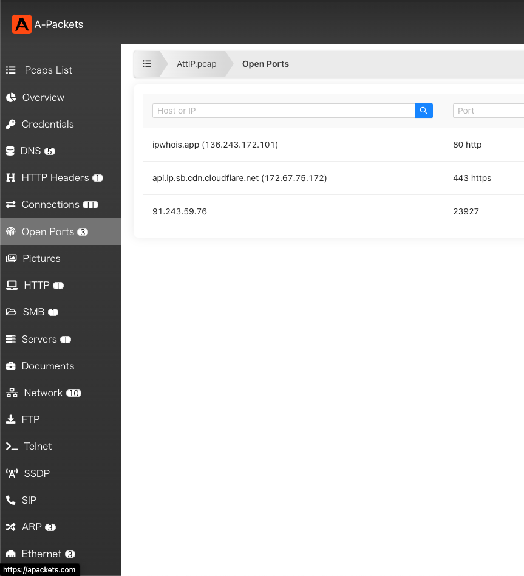

# 0xL4ughCTF 2023 <!-- omit in toc -->

https://ctf.0xl4ugh.com

- [Misc/Welcome](#miscwelcome)
  - [FLAG](#flag)
- [Misc/Welcome](#miscwelcome-1)
  - [writeup1](#writeup1)
  - [writeup2](#writeup2)
  - [FLAG](#flag-1)
  - [ref](#ref)


## Misc/Welcome

### FLAG

```
0xL4ugh{W3LC0ME_T0_0UR_C7F_FREE_PALESTINE}
```

## Misc/Welcome

This is a trojan, Can u identify the C2 server IP and the port?

Flag format: 0xL4ugh{IP_PORT}

Author: MMOX

### writeup1

pcapファイルをWiresharkで開き，http通信を調べると，jsonファイルを受け取る通信があった．

Follow TCP Streamをすると，以下の通信が行われていた．


通信内容とIPが内部アドレスでないことから，ここのIPとPortを入力するとフラグだった．

### writeup2

以下のサイトにpcapファイルを投稿し，"Open Ports"を見るとわかる．

https://apackets.com/



### FLAG

```
0xL4ugh{91.243.59.76_23927}
```

### ref

https://upadhyayraj.medium.com/ctf-write-up-0xl4ughctf-2023-12c54ca37cb1
