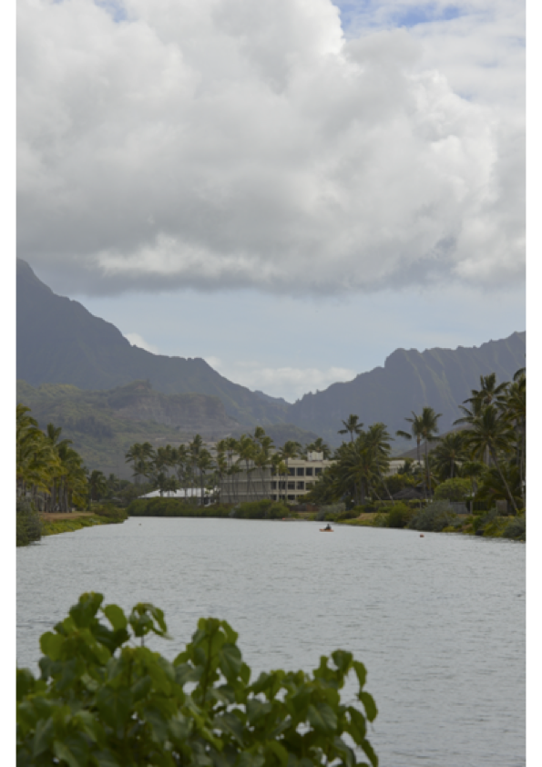
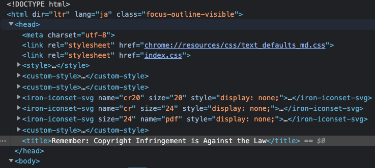

# CSAW CTF Qualification Round 2022

https://ctftime.org/event/1613

## rev/DockREleakage

A breach occurred and some files have been leaked. One of the leaked files named dockREleakage.tar.gz contains an image of one of the company's components. An anonymous hacker has reached out to me and beware me that there is some serious mistake in my build image process. The hacker implies that sensitive information should be handled carefully. However, I couldn't find the mistake by myself. Please help me!

### Description

jsonファイルを調べると`flag.txt`をガチャガチャしてました。明らかなbase64が見えたため、デコードすると`ZmxhZ3tuM3Yzcl9sMzR2M181M241MTcxdjNfMW5mMHJtNDcxMG5fdW5wcjA= -> flag{n3v3r_l34v3_53n5171v3_1nf0rm4710n_unpr0`となりました。

`dockREleakage/acbb216b17482071caca135101282177f6ffed7b8ee0bfc5323aae103c216d74.json`

```json
{
            "created": "2022-09-03T07:46:12.680399343Z",
            "created_by": "/bin/sh -c echo \"ZmxhZ3tuM3Yzcl9sMzR2M181M241MTcxdjNfMW5mMHJtNDcxMG5fdW5wcjA=\" > /dev/null",
            "empty_layer": true
        }

{
            "created": "2022-09-03T07:46:13.319972067Z",
            "created_by": "/bin/sh -c cat p-flag.txt > tmp.txt; rm -rf flag.txt p-flag.txt; mv tmp.txt flag.txt; echo \"\" >> flag.txt"
        }
```

後半部分がflag.txtにあると思い、探すと以下のディレクトリにありました。

`dockREleakage/928ab519cd995aeae5eced3dbe4b7e86c8bc7f7662ef0f73e59c2f30b2b3b8e4/chal/flag.txt`

```
73c73d_w17h1n_7h3_d0ck3rf1l3}
Find the rest of the flag by yourself!
```

### FLAG

```bash
flag{n3v3r_l34v3_53n5171v3_1nf0rm4710n_unpr073c73d_w17h1n_7h3_d0ck3rf1l3}
```

## forensics/Our Spy In New Terrain

### Description

It is up to you to determine who The Enemy is going to attack next and when they plan to strike! Their newest recruit is on twitter as DarkRoom8109. Good luck. nc misc.chal.csaw.io 5005

### SOLUTION

netcatを実行するとクイズが始まるので、順に答えていきます。先にフラグまでの一問一答を提示します。

```bash
$ nc misc.chal.csaw.io 5005
Welcome agent! We have reason to believe a user with the twitter handle Darkroom8109 is working with The Enemy! Can you help us determine what The Enemy is planning?
1. When did the enemy agent join twitter? Please use the format MM/YYYY
Please enter your answer:
08/2022
That's right!
2. What is the spy's github username?
Please enter your answer:
spyduhman
That's right!
3. What is the full name of the file that contains communications between The Enemy and the Evil Spy?
Please enter your answer:
log.txt
That's right!
4. Which country is the target based in?
Please enter your answer:
Canada
That's right!
5. What is the target's international Swift code?
Please enter your answer:
TDOMCATTTOR
That's right!
6. What is a crime?
What is the answer? Hint: it is two words
Copyright Infringement
That's right!
Congrats! Thanks to you, we now have more information about The Enemy's upcoming attack!
Here's a little reward for your trouble: flag{C0N6r475463N7600DW0rKN3X771M3N0PU811C53rV3r}
```

#### 1. When did the enemy agent join twitter? Please use the format MM/YYYY

twitterで問題文の`Darkroom8109`を調べ、join日を調べると2022年8月でした。

https://twitter.com/darkroom8109

#### 2. What is the spy's github username?

web archiveを調べると、`spyduhman`という名前で作ったと言及してました。

https://web.archive.org/web/20220820145418/https://twitter.com/darkroom8109

#### 3. What is the full name of the file that contains communications between The Enemy and the Evil Spy?

commitログを調べると、以下のURLで`log.txt`を消していることがわかりました。

https://github.com/spyduhman/Chat-App/commit/a651d57bc0e0559da5ca9e23652d6078537db83f

#### 4. Which country is the target based in?

先ほどのlog.txtに`Server: bit.ly/evilevilinfo`と短縮URLが記載されており、アクセスするとwavファイルが配布されました。

モールス信号が記録されていたため、適当なデコーダーで解析すると以下の通りとなりました。

```bash
$morse-audio-decoder Assignment.wav
HELLO EVIL AGENT YOUR NEXT TARGET IS A BANK THE BANKS BIN NUMBER IS 452234 THE TARGETS SWIFT CODE IS YOUR PASSWORD FOR MORE INSTRUCTIONS VISIT BIT.LY SLASH OSINTSEC GOOD LUCK
```

`A BANK THE BANKS BIN NUMBER IS 452234 THE TARGETS SWIFT CODE`とあったため、以下のサイトで調べると`Canada`だと分かりました。

https://www.getbankcodes.com/

#### 5. What is the target's international Swift code?

TORONTO DOMINION BANK系列だとわかったため、以下のsearchタブで`TORONTO`と調べました。

https://www.getbankcodes.com/country-canada/

Switfコードを順に入力すると`TDOMCATTTOR`が正解でした。

https://www.getbankcodes.com/swiftcode-tdomcatttor/

#### 6. What is a crime? What is the answer? Hint: it is two words

(ここpdfを落としてから、exifを調べたり、画像の場所を調べたりと色々したのですが分かりませんでした。pdfで検証ってできたんですね...)

モールス信号に書かれていたbitからpdfを落とせました。

```
THE TARGETS SWIFT CODE IS YOUR PASSWORD FOR MORE INSTRUCTIONS VISIT BIT.LY SLASH OSINTSEC GOOD LUCK
```



chromeでpdfを開き、パスワード`TDOMCATTTOR`を入力後、「検証」をすると`<title>Remember: Copyright Infringement is Against the Law</title>`が見えました。
というわけで、`Copyright Infringement`が正解です。




### FLAG

```bash
flag{C0N6r475463N7600DW0rKN3X771M3N0PU811C53rV3r}
```

### REF

https://www.youtube.com/watch?v=0KEj7GNXfQ8
