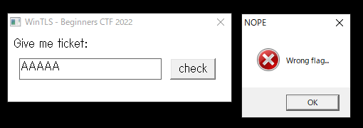

# WinTLS: 102 team solved

## Description


## writeup

PEファイルが渡されました。

```bash
$ file chall.exe
chall.exe: PE32+ executable (GUI) x86-64, for MS Windows
```

実行してみると、入力フォームがでてきて、適当な値を入力すると「Wrong value」と警告が出てきました。




以上の情報から、入力チェックをしていそうな関数をGhidraで探すと以下の関数が出てきました。
```java
LRESULT UndefinedFunction_004018f9(HWND param_1,uint param_2,WPARAM param_3,longlong param_4){
  LRESULT LVar1;
  tagPAINTSTRUCT atStack312 [3];
  DWORD DStack44;
  DWORD DStack40;
  DWORD DStack36;
  HDC pHStack32;
  HANDLE pvStack24;
  HANDLE pvStack16;
  
  if (param_2 == 0x111) {
    if ((short)param_3 != 0x1337) {
      return 0;
    }
    GetWindowTextA(hFlag,(LPSTR)atStack312,0x100);
    pvStack16 = CreateThread((LPSECURITY_ATTRIBUTES)0x0,0,(LPTHREAD_START_ROUTINE)&t1,atStack312,0,
                             &DStack36);
    pvStack24 = CreateThread((LPSECURITY_ATTRIBUTES)0x0,0,(LPTHREAD_START_ROUTINE)&t2,atStack312,0,
                             &DStack36);
    WaitForSingleObject(pvStack16,0xffffffff);
    WaitForSingleObject(pvStack24,0xffffffff);
    GetExitCodeThread(pvStack16,&DStack40);
    GetExitCodeThread(pvStack16,&DStack44);
    CloseHandle(pvStack16);
    CloseHandle(pvStack24);
    if ((DStack40 == 0) && (DStack44 == 0)) {
      MessageBoxA((HWND)0x0,"Correct flag!","DOPE",0x40);
    }
    else {
      MessageBoxA((HWND)0x0,"Wrong flag...","NOPE",0x10);
    }
    return 0;
  }
  if (param_2 < 0x112) {
    if (param_2 == 0xf) {
      pHStack32 = BeginPaint(param_1,(LPPAINTSTRUCT)atStack312);
      TextOutA(pHStack32,8,8,"Give me ticket:",0xf);
      EndPaint(param_1,(PAINTSTRUCT *)atStack312);
      return 0;
    }
    if (param_2 < 0x10) {
      if (param_2 == 1) {
        TLS = TlsAlloc();
        hFlag = CreateWindowExA(0,"EDIT","",0x50800080,0x10,0x26,200,0x1e,param_1,(HMENU)0xdead,
                                *(HINSTANCE *)(param_4 + 8),(LPVOID)0x0);
        CreateWindowExA(0,"BUTTON","check",0x50000000,0xe4,0x26,0x40,0x1e,param_1,(HMENU)0x1337,
                        *(HINSTANCE *)(param_4 + 8),(LPVOID)0x0);
        return 0;
      }
      if (param_2 == 2) {
        TlsFree(TLS);
        PostQuitMessage(0);
        return 0;
      }
    }
  }
  LVar1 = DefWindowProcA(param_1,param_2,param_3,param_4);
  return LVar1;
}
```

ここで、t1,t2を調べるとフラグらしき文字列を含んだ処理が出てきました。`UndefinedFunction_004017d1`では、3倍かつ5倍ではないときに配列に何かを格納し、`UndefinedFunction_0040159d`では3倍または5倍のとき、同様に配列に何かを格納していました。

```java
void UndefinedFunction_004017d1(longlong param_1){
  iStack12 = 0;
  TlsSetValue(TLS,"tfb%s$T9NvFyroLh@89a9yoC3rPy&3b}");
  for (uStack16 = 0;
      (uStack16 < 0x100 && (cStack17 = *(char *)(param_1 + (int)uStack16), cStack17 != '\0'));
      uStack16 = uStack16 + 1) {
    if (((int)uStack16 % 3 != 0) && ((int)uStack16 % 5 != 0)) {
      lVar1 = (longlong)iStack12;
      iStack12 = iStack12 + 1;
      acStack280[lVar1] = cStack17;
    }
  }
  acStack280[iStack12] = '\0';
  check(acStack280);
  return;
}

void UndefinedFunction_0040159d(longlong param_1){
  TlsSetValue(TLS,"c4{fAPu8#FHh2+0cyo8$SWJH3a8X");
  for (uStack16 = 0;
      (uStack16 < 0x100 && (cStack17 = *(char *)(param_1 + (int)uStack16), cStack17 != '\0'));
      uStack16 = uStack16 + 1) {
    if (((int)uStack16 % 3 == 0) || ((int)uStack16 % 5 == 0)) {
      lVar1 = (longlong)iStack12;
      iStack12 = iStack12 + 1;
      *(char *)((longlong)&uStack280 + lVar1) = cStack17;
    }
  }
  *(undefined *)((longlong)&uStack280 + (longlong)iStack12) = 0;
  check((char *)&uStack280);
  return;
}
```

以上の情報をもとに、フラグっぽい文字列のindexからフラグを復元できないかと思い以下のスクリプトを組みました。

```python
t1 = "c4{fAPu8#FHh2+0cyo8$SWJH3a8X"
t2 = "tfb%s$T9NvFyroLh@89a9yoC3rPy&3b}"

res = ""
t1_idx = 0
t2_idx = 0

for i in range(len(t1) + len(t2)):
  if i % 3 == 0 or i % 5 == 0 :
    res += t1[t1_idx]
    t1_idx += 1
  else:
    res += t2[t2_idx]
    t2_idx += 1

print(res)
```

## FLAG

```bash
ctf4b{f%sAP$uT98Nv#FFHyrh2o+Lh0@8c9yoa98$ySoCW3rJPH3y&a83Xb}
```

## REF

https://blog.y011d4.com/20220605-ctf4b-writeup#wintls
