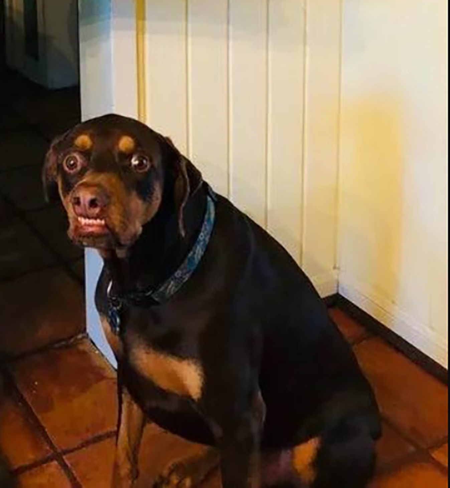

# DEADFACE CTF(2022)

https://ctftime.org/event/1692

- [DEADFACE CTF(2022)](#deadface-ctf2022)
  - [Steganography/The Goodest Boy](#steganographythe-goodest-boy)
    - [SOLUTION](#solution)
    - [FLAG](#flag)
  - [OSINT/Under Public Scrutiny](#osintunder-public-scrutiny)
    - [SOLUTION](#solution-1)
    - [FLAG](#flag-1)

## Steganography/The Goodest Boy

We found this image on Ghost Town. We think bumpyhassan hid some information here. Can you see what information he hid?



### SOLUTION

あおぞらで画像を解析すると、steghideが施されていることが分かりました。パスワードは「borkbork」と書かれていたので、steghideを使うとpdfが出てきて、そこにフラグが書かれていました。

### FLAG

```
flag{whos_A_g00d_boi_bork_bork}
```


## OSINT/Under Public Scrutiny

We found this image on Ghost Town. We think bumpyhassan hid some information here. Can you see what information he hid?

GhostTown Thread


### SOLUTION

GhostTownで「GitHub」と検索すると、以下のThreadがひっかかりました。

https://ghosttown.deadface.io/t/made-a-github-link-for-projects/66/4


「the account is deadf4c3」とあったので、GitHubで検索すると以下のリポジトリにflagが記載されていました。

https://github.com/deadf4c3/tarrasque


### FLAG

```
flag{yAy_4_puBl1c_g1tHUB_rep0s}
```
