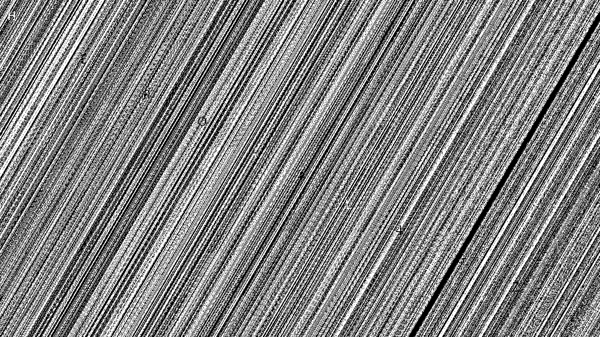
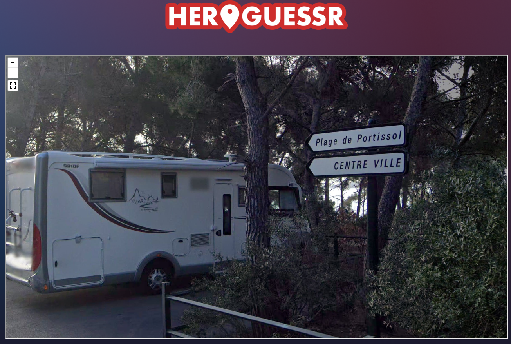

# HeroCTF v4

https://ctftime.org/event/1663

## Crypto

### Poly321:50

very easy

An unskilled mathematician has created an encryption function. Can you decrypt the message ?

Format : Hero{flag}

Author : xanhacks

#### writeup

配布されたpyコードにフラグを入力したときの、暗号化した文字列が書かれていました。
フラグとなる文字列を全て暗号化したときの文字列と比較して、一致したときのインデックスと平文を保存すればフラグを復号できます。

```bash
$ python3 encrypt.py
[378504, 1040603, 1494654, 1380063, 1876119, 1574468, 1135784, 1168755, 1534215, 866495, 1168755, 1534215, 866495, 1657074, 1040603, 1494654, 1786323, 866495, 1699439, 1040603, 922179, 1236599, 866495, 1040603, 1343210, 980199, 1494654, 1786323, 1417584, 1574468, 1168755, 1380063, 1343210, 866495, 188499, 127550, 178808, 135303, 151739, 127550, 112944, 178808, 1968875]
```

```python
#!/usr/bin/env python3

# all string
FLAG = "1234567890qwertyuiopasdfghjklzxcvbnm! QWERTYUIOPASDFGHJKLZXCVBNM{}_.,"

# encrypted flag: len is 43
enc_flag = [378504, 1040603, 1494654, 1380063, 1876119, 1574468, 1135784, 1168755, 1534215, 866495, 1168755, 1534215, 866495, 1657074, 1040603, 1494654, 1786323, 866495, 1699439, 1040603, 922179, 1236599, 866495, 1040603, 1343210, 980199, 1494654, 1786323, 1417584, 1574468, 1168755, 1380063, 1343210, 866495, 188499, 127550, 178808, 135303, 151739, 127550, 112944, 178808, 1968875]

# convert from original encrypt.py
all = [120099, 127550, 135303, 143364, 151739, 160434, 169455, 178808, 188499, 112944, 1455779, 1699439, 1040603, 1494654, 1574468, 1786323, 1615419, 1168755, 1380063, 1417584, 922179, 1534215, 1010100, 1071714, 1103439, 1135784, 1202358, 1236599, 1271484, 1830854, 1742520, 980199, 1657074, 950894, 1343210, 1307019, 37059, 33824, 538083, 666159, 333339, 558174, 599844, 712979, 621435, 394419, 499359, 518480, 278915, 578759, 319124, 347970, 363023, 378504, 410774, 427575, 444828, 737190, 689304, 305319, 643538, 291918, 480714, 462539, 1876119, 1968875, 866495, 99498, 87164]

enc = []
dec = [''] * 43

for c in FLAG:
    v = ord(c)
    encrypted = v + pow(v, 2) + pow(v, 3)
    enc.append(encrypted)
    # decryption
    for i in range(len(enc_flag)):
        if enc_flag[i] == encrypted:
            dec[i] = c
# flag
for i in range(len(dec)): print(dec[i], end="")
print()
```

```bash
Hero{this_is_very_weak_encryption_92835208}
```


## Steganography

### Colorz: 50

easy stega

It's all about the colors.

Format : Hero{flag}

Author : Thib

#### writeup

stegsovleでフラグが現れました。



```
HERO{fL4GZ}
```

## osint

### HeroGuessr#1: 50

easy

Aaah, the South of France... the pétanque, the pastis, the marseillais qui savent pas conduire... I played a few games of pétanque in this park, sadly I can't remember its name. Can you find it ?

Format : Hero{Name Of The Parc}

Author : Alol

#### writeup

提示されたURLにアクセスすると、移動なしのストリートビューが出てきました。

看板に地名らしき文字がありました。



地名で調べると`Beach Portissol (Plage de Portissol)`と出てきました。

近くの公園の名前がフラグとなっていますので、周辺を調べると`Parc Victorin Blanc`がありました。

```
Hero{Parc Victorin Blanc}
```

ストリートビューの位置はここですね。

https://www.google.com/maps/@43.1171588,5.7811387,3a,75y,267.12h,73.65t/data=!3m9!1e1!3m7!1spl8QK5qSCoDa_5QlsmNdMg!2e0!7i16384!8i8192!9m2!1b1!2i29?hl=ja


## Prog

### Heist: 50

easy

This new online bank is supposely unbreakable. They want us to prove it to the world. Here is the source code. It's messy, but simple. I can feel something's wrong, but I am not sure what.
Help me out will you ?

Host : prog.heroctf.fr, Port : 7001

Format : Hero{flag}

Author : Log_s

#### writeup

送金して、フラグを買うというものらしい。
フラグは100ドルで所持金は10ドルしかないため、このままでは足りない。
マイナスの対応ができてないと思い、-100を入力すると、100ドル手に入れたことになった。あとはフラグを購入すれば良い。

```bash
=== Transfer Protocol ===

How much do you want to transfer the bank ?
>> -100
Transfer completed !
Press enter to continue...

Welcome to the HeroStore !
Here you can buy all sorts of things. Sadly, our stocks suffered from our success, and only one item remains. It's therefore pretty expensive.

Choose an option :
1 - Fl4g (100$)
2 - Back to Dashboard
>> 1
Congratz ! Here is your item : Hero{ch3ck_4_n3g4t1v3s}
```
