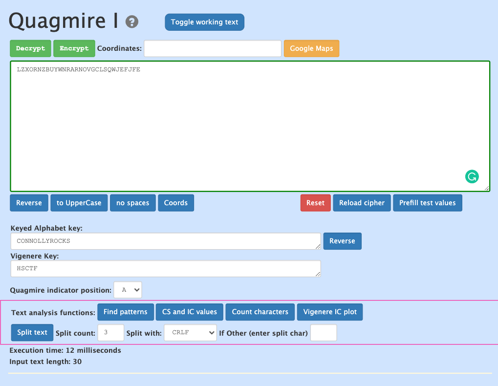

# crypto

## lcvc

Ciphertext: mawhxyovhiiupukqnzdekudetmjmefkqjgmqndgtnrxqxludegwovdcdmjjhw Please wrap in the flag format: flag{}

### writeup

Ciphertextをflag{}で囲い、無限ループで暗号文を抽出しました。

```python
def chall(flag):
    state = 1
    alphabet = "abcdefghijklmnopqrstuvwxyz"
    assert(flag[0:5]+flag[-1]=="flag{}")
    ciphertext = ""
    for character in flag[5:-1]:
        state = (15*state+18)%29
        ciphertext+=alphabet[(alphabet.index(character)+state)%26]
    return ciphertext

flag = "flag{mawhxyovhiiupukqnzdekudetmjmefkqjgmqndgtnrxqxludegwovdcdmjjhw}"
while True:
    flag = chall(flag)
```

以下の暗号文が周期的に現れたため、観察していると、下から二番目の暗号文が英文でした。

```
quyxpewjtyiwvuuapxzmguvsxyhaizmgbmueztgvtrhazjqlagoczparqdlxo
uoaaukrxsoiyohexeiiucuntokfbmtojgspsyjgxmerxouztwggdqbysuxnat
yicdzqmlreiahuouttrcyufufwdcqnqmlykgxzgzfrbudfibsgyehnwtyrpdy
ccegewhzquicahyrieakuuxvwibduhspqefuwpgbyelrsqrjogqfyzuuclrgd
gwgjjccnpkietuioxpjsqupwnuzeybusvkaivfgdrrvohbarkgigplsvgftji
kqimoixboaigmhslmasamuhxegxfcvwvaqvwuvgfkeflwmjzggahgxqwkzvmn
okkptospnqiifuciblbiiuzyvsvggpyyfwqktlghdrpilxshcgsixjoxotxps
semsyundmgikyhmfqwkqeurzmethkjabkclysbgjwezfaibpygkjovmysnzsx
wyovdairlwimruwcfhtyaujadqriodcepigmrrglprjcptkxugckfhkzwhbvc
asqyigdfkmiokhgzuscgwubbucpjsxehuobaqhgnietzeetfqgulwtiaabdyh
emsbnmytjciqduqwjdlosutclonkwrgkzuwopxgpbrdwtpcnmgmmnfgbevfbm
iguessthisiswhatyouwouldcallalinearcongruentialvigenerecipher <------
mawhxyovhiiupukqnzdekudetmjmefkqjgmqndgtnrxqxludegwovdcdmjjhw
```

### flag

```
flag{iguessthisiswhatyouwouldcallalinearcongruentialvigenerecipher}
```


## quagmire-i

Bob was on his way to school and go to Mr. Connolly’s first period AP CSA class, but it was a rainy day and he got stuck in the quagmire in his town, making him late to school (specifically the first closest to his home, there are apparently four quagmires in his town)! Could you figure out what Mr. Connolly told Bob’s class? His classmate Alice sent this text message after class (written in Quagmire I):

```
Plaintext keyword: CONNOLLYROCKS
Indicator keyword: HSCTF
Indicator position: A
Ciphertext: LZXORNZBUYWNRARNOVGCLSQWJEFJFE
```

### writeup

オンラインツールを使いました。

https://mysterytoolbox.organisingchaos.com/Ciphers/cipher/QuagmireI

画像の状態でDecryptを押すと`FILLTHISBOWLWITHYOURFAVEFRUITS`が出てきました。




### flag

```
flag{FILLTHISBOWLWITHYOURFAVEFRUITS}
```

