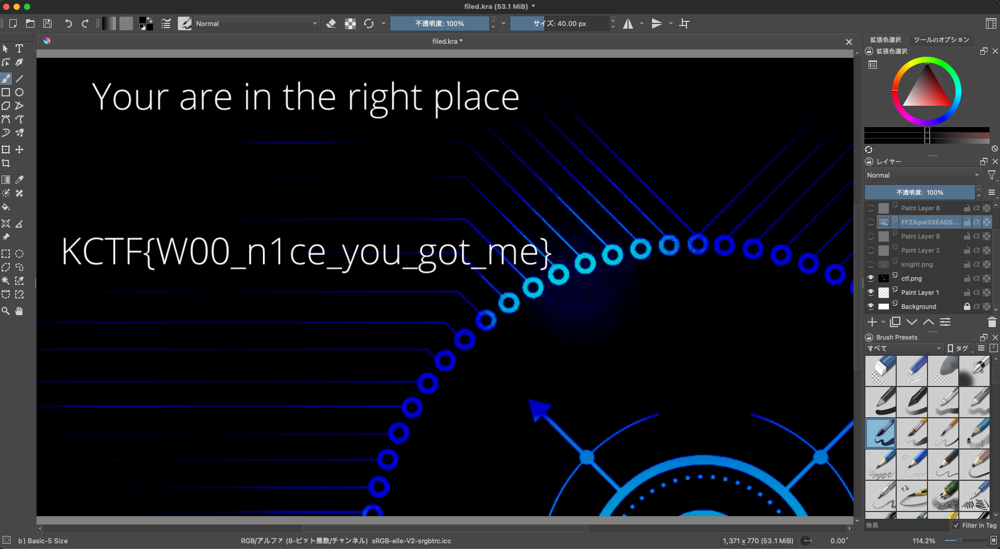

# FileD

25

## description

Can you see everything?

Flag Format: KCTF{S0m3_text_h3r3}

Author: 1xR1fat

## writeup

kraファイルが与えれるため、専用のソフトで開く。
今回は、kritaを使用した([URL](https://krita.org/en/download/krita-desktop/))。

ファイルを開くと、画面右側のレイヤーにファイルが多数あることがわかった。1つずつ見ていくと`ctf.png`と書かれたレイヤーがあり、そこにフラグが記載されていた。



## FLAG

```txt
KCTF{W00_n1ce_you_got_me}
```
