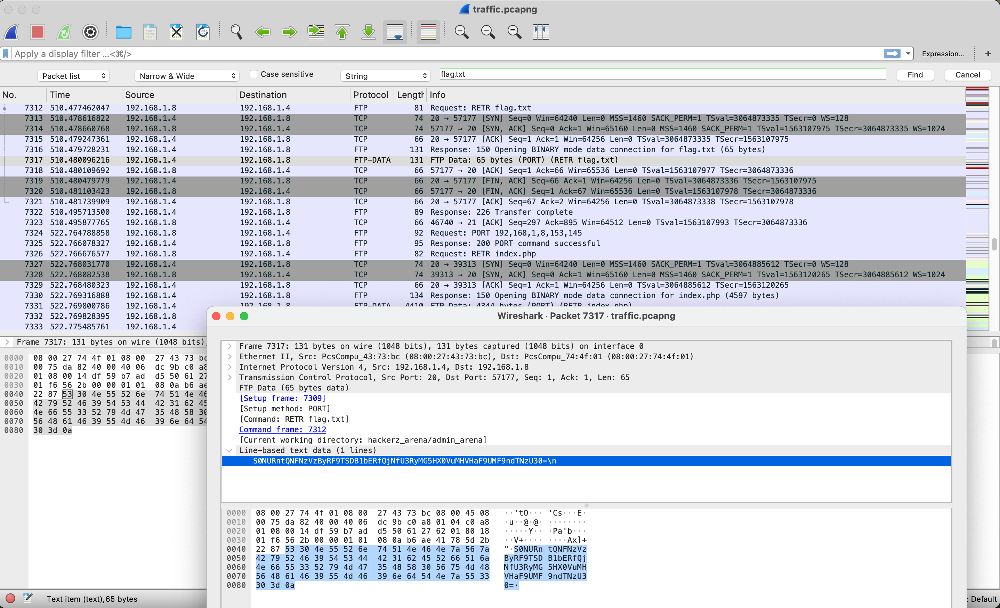

# FTP Flag

## description

25

What is the ftp flag?

Use Compromised CTF Platform's Challenge file to analyze.

Flag Format: KCTF{Fl4g_H3r3}

Author : TareqAhamed

## writeup

FTPでフィルターをかけると、`flag.txt`が見えたため、追ってみました。
すると、base64でエンコードされた文字列が見えたため、デコードしました。



```
S0NURntQNFNzVzByRF9TSDB1bERfQjNfU3RyMG5HX0VuMHVHaF9UMF9ndTNzU30=
KCTF{P4SsW0rD_SH0ulD_B3_Str0nG_En0uGh_T0_gu3sS}
```

## FLAG

```txt
KCTF{P4SsW0rD_SH0ulD_B3_Str0nG_En0uGh_T0_gu3sS}
```
