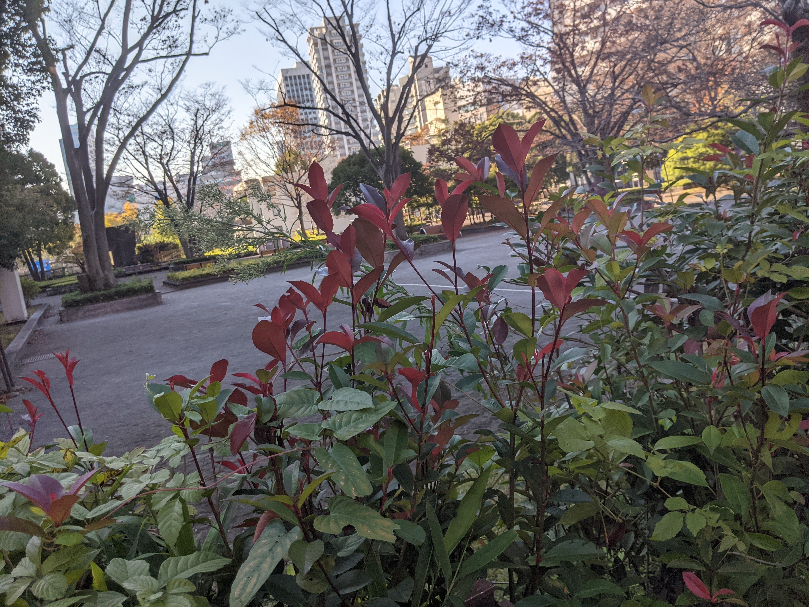

# Open xINT CTF 2022

http://openxintctf.pinja.xyz:2022/

- [[NET 100] whois (106 solved)](#net-100-whois-106-solved)
- [[NET 39] SSID (39 solved)](#net-39-ssid-39-solved)
- [[HUMAN 200] saitaku (56 Solves)](#human-200-saitaku-56-solves)
- [[PLACE 100] spacious (56 solved)](#place-100-spacious-56-solved)


## [NET 100] whois (106 solved)

194.146.200.33 のAS番号を答えよ. Answer the AS number for 194.146.200.33.

### SOLUTION

以下のサイトにアドレスを入力しました。whoisでは解けずに一瞬あれ？となりました。

https://mxtoolbox.com/SuperTool.aspx?action=asn%3a194.146.200.33&run=toolpage

```
42574
```


## [NET 39] SSID (39 solved)

SSID:YKAMEのBSSIDを答えよ。Answer the BSSID of SSID:YKAME.

### SOLUTION

wigle.netのbasic searchから、`SSID / Network Name (wildcards1: % and _):`の欄に`YKAME`を入力するとフラグが出てきました。

```
WPA2    YKAME     QoS: 0      type: infra
90:84:0D:F0:D1:D3     ch: 11     2016-11-26 - 2016-11-26
```

```
90:84:0D:F0:D1:D3
```

---

以下、時間内で解けなかった問題

## [HUMAN 200] saitaku (56 Solves)

この商品を販売している会社の社長の名前をフルネームで答えよ。


### SOLUTION

saitakuの住所を調べるとスイスにあることが分かった。

http://www.saitaku-food.com/contact-us/

スイスの会社登録がされているページに情報があるだろうと思い「Switzerland company lookup」などで調べ、以下のサイトに会社の住所を入力すると「Ethnic Distribution GmbH」が出てきた。

https://www.info-clipper.com/en/?q=ShowDetails&ellis=1&retry=1&sid=420078078&country_code=CH

会社名を検索してExecutive boardの欄を送信すると、フラグだった。

https://www.moneyhouse.ch/en/company/ethnic-distribution-gmbh-4849057061


```
Roger Häcki
```

## [PLACE 100] spacious (56 solved)

写真に写っている場所の名前を答えよ。What is the name of this place in the photo?





### SOLUTION

看板から「トヨタモビリティパーツ」だと分かる。[支社は全国にある](https://toyota-mp.co.jp/company/)にあるが、AVTokyoというからには、東京にフラグがあると思い東京支社をGoogle Mapで調べると、ユーザー投稿に近い写真があった([URL](https://www.google.com/maps/place/%E3%83%88%E3%83%A8%E3%82%BF+%E3%83%A2%E3%83%93%E3%83%AA%E3%83%86%E3%82%A3%E3%83%91%E3%83%BC%E3%83%84%E3%88%B1+%E6%9D%B1%E4%BA%AC%EF%BD%A5%E5%B1%B1%E6%A2%A8%E7%B5%B1%E6%8B%AC%E6%94%AF%E7%A4%BE/@35.656592,139.7445549,3a,75y,90t/data=!3m8!1e2!3m6!1sAF1QipPjR-3LpIkHlJnm4NLu62rkFpxfML3XiQhSb65L!2e10!3e12!6shttps:%2F%2Flh5.googleusercontent.com%2Fp%2FAF1QipPjR-3LpIkHlJnm4NLu62rkFpxfML3XiQhSb65L%3Dw529-h298-k-no!7i4000!8i2252!4m11!1m2!2m1!1z44OI44Oo44K_44Oi44OT44Oq44OG44Kj44OR44O844OE5p2x5Lqs5pSv56S-!3m7!1s0x60188bbc5580f13f:0xf9918b0785f2524b!8m2!3d35.6566236!4d139.7447721!14m1!1BCgIgAQ!15sCi3jg4jjg6jjgr_jg6Ljg5Pjg6rjg4bjgqPjg5Hjg7zjg4TmnbHkuqzmlK_npL6SARdhdXRvX3BhcnRzX21hbnVmYWN0dXJlcuABAA))。

ここで、spacious -> 広い　と連想して周囲を調べると「いきいき広場」「のびのび広場」があった。前者がフラグだった。

```
いきいき広場
```

## 後でやる

- PLACE/video
- NET/BB

