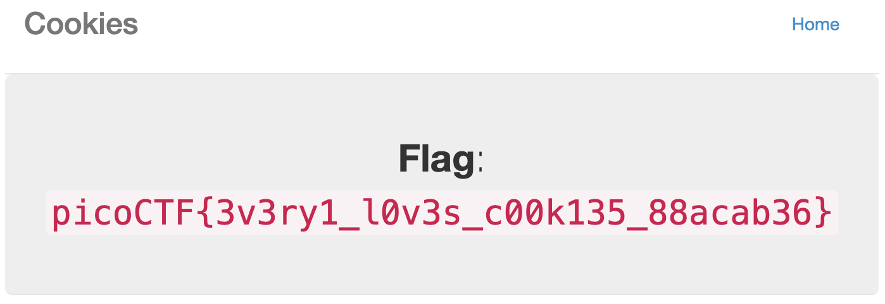

# Cookies

AUTHOR: MADSTACKS

## Description

Who doesn't love cookies? Try to figure out the best one.

## writeup

フォームに`aaa`を入力して，devToolsを確認するとCokkieが`name=-1`となっていた．
次に`snickerdoodle`を入力すると，`name=0`となった．

ここから，Burpsuiteを用いて，`name=`を1つずつずらして変化があるかを確認する．

### Burpsuiteの使用手順

Proxy -> Open Brwoser -> 問題ページ の順にアクセスする．

> ちなみに、burpsuiteの「intersept is on」は、通信をキャプチャしている状態で、
「forward」は、開いたブラウザに適用
「drop」は、キャプチャを破棄
「action」タブで細かな設定ができます。
https://qwertytan.hatenablog.jp/entry/2021/09/05/113104

とあるので，リクエストが全て変えるまでforwardを押します．

この時，`name=2`にすると`I love oatmeal raisin cookies!`とresponseに変化が現れた．


これをflagが現れるまで続けると`name=18`の時にFlagが出現した．



## FLAG

```bash
picoCTF{3v3ry1_l0v3s_c00k135_88acab36}
```

## 参考

- https://qwertytan.hatenablog.jp/entry/2021/09/05/113104
- https://qiita.com/housu_jp/items/c742874298f446795995
