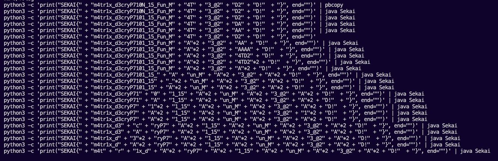

# SekaiCTF 2022

https://ctf.sekai.team/

- [SekaiCTF 2022](#sekaictf-2022)
  - [rev: Matrix Lab 1](#rev-matrix-lab-1)
    - [SOLUTION](#solution)
    - [FLAG](#flag)
    - [感想](#感想)

## rev: Matrix Lab 1

Welcome to the first lab of Course ML10001 from Sekai University! The Lab 1 assignment should be pretty easy...

Author: sahuang

### SOLUTION

配布された.classファイルをIntelliJ IDEAでデコンパイルします。その結果、以下の内容が出力されたため`Sekai.java`として保存しました。
コードの内容を見るに、入力した文字列にある処理を施し、`oz]{R]3l]]B#50es6O4tL23Etr3c10_F4TD2`と一致したとき、フラグとなることが分かりました。

```java
//
// Source code recreated from a .class file by IntelliJ IDEA
// (powered by FernFlower decompiler)
//

import java.util.Scanner;

public class Sekai {
    private static int length = (int)Math.pow(2.0, 3.0) - 2;

    public Sekai() {
    }

    public static void main(String[] var0) {
        Scanner var1 = new Scanner(System.in);
        System.out.print("Enter the flag: ");
        String var2 = var1.next();
        if (var2.length() != 43) {
            System.out.println("Oops, wrong flag!");
        } else {
            String var3 = var2.substring(0, length);
            String var4 = var2.substring(length, var2.length() - 1);
            String var5 = var2.substring(var2.length() - 1);
            if (var3.equals("SEKAI{") && var5.equals("}")) {
                assert var4.length() == length * length;
                System.out.println("Nice, you got the flag!");
                if (solve(var4)) {
                    System.out.println("Congratulations, you got the flag!");
                } else {
                    System.out.println("Oops, wrong flag!");
                }
            } else {
                System.out.println("Oops, wrong flag!");
            }

        }
    }

    public static String encrypt(char[] input, int var1) {
        char[] array = new char[length * 2];
        int pre_len = length - 1;
        int len = length;

        int i;
        for(i = 0; i < length * 2; ++i) {
            array[i] = input[pre_len--];
            array[i + 1] = input[len++];
            ++i;
        }

        for(i = 0; i < length * 2; ++i) {
            array[i] ^= (char)var1;
        }

        return String.valueOf(array);
    }

    public static char[] getArray(char[][] input, int var1, int var2) {
        char[] var3 = new char[length * 2];
        int var4 = 0;

        int i;
        for(i = 0; i < length; ++i) {
            var3[var4] = input[var1][i];
            ++var4;
        }

        for(i = 0; i < length; ++i) {
            var3[var4] = input[var2][length - 1 - i];
            ++var4;
        }

        return var3;
    }

    public static char[][] transform(char[] array, int len) {
        char[][] transformed_array = new char[len][len];

        for(int index = 0; index < len * len; ++index) {
            transformed_array[index / len][index % len] = array[index];
        }

        return transformed_array;
    }

    public static boolean solve(String input) {
        char[][] tr_input = transform(input.toCharArray(), length);

        for(int i = 0; i <= length / 2; ++i) {
            for(int j = 0; j < length - 2 * i - 1; ++j) {
                char tmp_tr_input = tr_input[i][i + j];
                tr_input[i][i + j] = tr_input[length - 1 - i - j][i];
                tr_input[length - 1 - i - j][i] = tr_input[length - 1 - i][length - 1 - i - j];
                tr_input[length - 1 - i][length - 1 - i - j] = tr_input[i + j][length - 1 - i];
                tr_input[i + j][length - 1 - i] = tmp_tr_input;
            }
        }

        String var10001 = encrypt(getArray(tr_input, 0, 5), 2);
        System.out.println(var10001 + encrypt(getArray(tr_input, 1, 4), 1) + encrypt(getArray(tr_input, 2, 3), 0));
        return "oz]{R]3l]]B#50es6O4tL23Etr3c10_F4TD2".equals(var10001 + encrypt(getArray(tr_input, 1, 4), 1) + encrypt(getArray(tr_input, 2, 3), 0));
    }
}
```

あとは`SEKAI{"A" * 36}`を初期値として、力技で順番に入れていき、わかったとこから埋めていきました。
```python
import sys
import string
import subprocess

flag_len = 36
tmp_flag = "mAAAAx_AAAAyPAAAA_1AAAAn_AAAAAAA_AAA"
flag_can = string.ascii_letters + string.digits + string.punctuation   # フラグの候補
enc_flag = "oz]{R]3l]]B#50es6O4tL23Etr3c10_F4TD2"  # 正解

already_dec_index = [0, 5, 6, 11, 12, 17, 18, 23, 24, 32] # 埋まってるindex

# while True:
for i,j in enumerate(flag_can):
  flag = "SEKAI{"
  for k in range(flag_len):
    if k in already_dec_index:
      flag += tmp_flag[k]
    else:
      flag += j
  flag += "}"
  flag = flag.strip()
  r = subprocess.run(['java Sekai'], shell=True, input=flag, text=True, stdout=subprocess.PIPE)
  res_list = r.stdout.split("\n")
  return_enc = res_list[1]
  print(flag, return_enc)
```

生成途中の様子。右側と`oz]{R]3l]]B#50es6O4tL23Etr3c10_F4TD2`を見比べた。

```
SEKAI{maaaax_aaaayPaaaa_1aaaan_aaaaaaa_aaa} oz]{R]3l]ccc````````````aaaaaaaaaa_a
SEKAI{mbbbbx_bbbbyPbbbb_1bbbbn_bbbbbbb_bbb} oz]{R]3l]```ccccccccccccbbbbbbbbbb_b
SEKAI{mccccx_ccccyPcccc_1ccccn_ccccccc_ccc} oz]{R]3l]aaabbbbbbbbbbbbcccccccccc_c
SEKAI{mddddx_ddddyPdddd_1ddddn_ddddddd_ddd} oz]{R]3l]fffeeeeeeeeeeeedddddddddd_d
SEKAI{meeeex_eeeeyPeeee_1eeeen_eeeeeee_eee} oz]{R]3l]gggddddddddddddeeeeeeeeee_e
SEKAI{mffffx_ffffyPffff_1ffffn_fffffff_fff} oz]{R]3l]dddggggggggggggffffffffff_f
SEKAI{mggggx_ggggyPgggg_1ggggn_ggggggg_ggg} oz]{R]3l]eeeffffffffffffgggggggggg_g
SEKAI{mhhhhx_hhhhyPhhhh_1hhhhn_hhhhhhh_hhh} oz]{R]3l]jjjiiiiiiiiiiiihhhhhhhhhh_h
SEKAI{miiiix_iiiiyPiiii_1iiiin_iiiiiii_iii} oz]{R]3l]kkkhhhhhhhhhhhhiiiiiiiiii_i
SEKAI{mjjjjx_jjjjyPjjjj_1jjjjn_jjjjjjj_jjj} oz]{R]3l]hhhkkkkkkkkkkkkjjjjjjjjjj_j
SEKAI{mkkkkx_kkkkyPkkkk_1kkkkn_kkkkkkk_kkk} oz]{R]3l]iiijjjjjjjjjjjjkkkkkkkkkk_k
SEKAI{mllllx_llllyPllll_1lllln_lllllll_lll} oz]{R]3l]nnnmmmmmmmmmmmmllllllllll_l
SEKAI{mmmmmx_mmmmyPmmmm_1mmmmn_mmmmmmm_mmm} oz]{R]3l]ooollllllllllllmmmmmmmmmm_m
SEKAI{mnnnnx_nnnnyPnnnn_1nnnnn_nnnnnnn_nnn} oz]{R]3l]llloooooooooooonnnnnnnnnn_n
SEKAI{moooox_ooooyPoooo_1oooon_ooooooo_ooo} oz]{R]3l]mmmnnnnnnnnnnnnoooooooooo_o
SEKAI{mppppx_ppppyPpppp_1ppppn_ppppppp_ppp} oz]{R]3l]rrrqqqqqqqqqqqqpppppppppp_p
SEKAI{mqqqqx_qqqqyPqqqq_1qqqqn_qqqqqqq_qqq} oz]{R]3l]sssppppppppppppqqqqqqqqqq_q
SEKAI{mrrrrx_rrrryPrrrr_1rrrrn_rrrrrrr_rrr} oz]{R]3l]pppssssssssssssrrrrrrrrrr_r
SEKAI{mssssx_ssssyPssss_1ssssn_sssssss_sss} oz]{R]3l]qqqrrrrrrrrrrrrssssssssss_s
SEKAI{mttttx_ttttyPtttt_1ttttn_ttttttt_ttt} oz]{R]3l]vvvuuuuuuuuuuuutttttttttt_t
SEKAI{muuuux_uuuuyPuuuu_1uuuun_uuuuuuu_uuu} oz]{R]3l]wwwttttttttttttuuuuuuuuuu_u
SEKAI{mvvvvx_vvvvyPvvvv_1vvvvn_vvvvvvv_vvv} oz]{R]3l]tttwwwwwwwwwwwwvvvvvvvvvv_v
SEKAI{mwwwwx_wwwwyPwwww_1wwwwn_wwwwwww_www} oz]{R]3l]uuuvvvvvvvvvvvvwwwwwwwwww_w
SEKAI{mxxxxx_xxxxyPxxxx_1xxxxn_xxxxxxx_xxx} oz]{R]3l]zzzyyyyyyyyyyyyxxxxxxxxxx_x
SEKAI{myyyyx_yyyyyPyyyy_1yyyyn_yyyyyyy_yyy} oz]{R]3l]{{{xxxxxxxxxxxxyyyyyyyyyy_y
SEKAI{mzzzzx_zzzzyPzzzz_1zzzzn_zzzzzzz_zzz} oz]{R]3l]xxx{{{{{{{{{{{{zzzzzzzzzz_z
SEKAI{mAAAAx_AAAAyPAAAA_1AAAAn_AAAAAAA_AAA} oz]{R]3l]CCC@@@@@@@@@@@@AAAAAAAAAA_A
SEKAI{mBBBBx_BBBByPBBBB_1BBBBn_BBBBBBB_BBB} oz]{R]3l]@@@CCCCCCCCCCCCBBBBBBBBBB_B
SEKAI{mCCCCx_CCCCyPCCCC_1CCCCn_CCCCCCC_CCC} oz]{R]3l]AAABBBBBBBBBBBBCCCCCCCCCC_C
SEKAI{mDDDDx_DDDDyPDDDD_1DDDDn_DDDDDDD_DDD} oz]{R]3l]FFFEEEEEEEEEEEEDDDDDDDDDD_D
SEKAI{mEEEEx_EEEEyPEEEE_1EEEEn_EEEEEEE_EEE} oz]{R]3l]GGGDDDDDDDDDDDDEEEEEEEEEE_E
SEKAI{mFFFFx_FFFFyPFFFF_1FFFFn_FFFFFFF_FFF} oz]{R]3l]DDDGGGGGGGGGGGGFFFFFFFFFF_F
SEKAI{mGGGGx_GGGGyPGGGG_1GGGGn_GGGGGGG_GGG} oz]{R]3l]EEEFFFFFFFFFFFFGGGGGGGGGG_G
SEKAI{mHHHHx_HHHHyPHHHH_1HHHHn_HHHHHHH_HHH} oz]{R]3l]JJJIIIIIIIIIIIIHHHHHHHHHH_H
SEKAI{mIIIIx_IIIIyPIIII_1IIIIn_IIIIIII_III} oz]{R]3l]KKKHHHHHHHHHHHHIIIIIIIIII_I
SEKAI{mJJJJx_JJJJyPJJJJ_1JJJJn_JJJJJJJ_JJJ} oz]{R]3l]HHHKKKKKKKKKKKKJJJJJJJJJJ_J
SEKAI{mKKKKx_KKKKyPKKKK_1KKKKn_KKKKKKK_KKK} oz]{R]3l]IIIJJJJJJJJJJJJKKKKKKKKKK_K
SEKAI{mLLLLx_LLLLyPLLLL_1LLLLn_LLLLLLL_LLL} oz]{R]3l]NNNMMMMMMMMMMMMLLLLLLLLLL_L
SEKAI{mMMMMx_MMMMyPMMMM_1MMMMn_MMMMMMM_MMM} oz]{R]3l]OOOLLLLLLLLLLLLMMMMMMMMMM_M
SEKAI{mNNNNx_NNNNyPNNNN_1NNNNn_NNNNNNN_NNN} oz]{R]3l]LLLOOOOOOOOOOOONNNNNNNNNN_N
SEKAI{mOOOOx_OOOOyPOOOO_1OOOOn_OOOOOOO_OOO} oz]{R]3l]MMMNNNNNNNNNNNNOOOOOOOOOO_O
SEKAI{mPPPPx_PPPPyPPPPP_1PPPPn_PPPPPPP_PPP} oz]{R]3l]RRRQQQQQQQQQQQQPPPPPPPPPP_P
SEKAI{mQQQQx_QQQQyPQQQQ_1QQQQn_QQQQQQQ_QQQ} oz]{R]3l]SSSPPPPPPPPPPPPQQQQQQQQQQ_Q
SEKAI{mRRRRx_RRRRyPRRRR_1RRRRn_RRRRRRR_RRR} oz]{R]3l]PPPSSSSSSSSSSSSRRRRRRRRRR_R
SEKAI{mSSSSx_SSSSyPSSSS_1SSSSn_SSSSSSS_SSS} oz]{R]3l]QQQRRRRRRRRRRRRSSSSSSSSSS_S
SEKAI{mTTTTx_TTTTyPTTTT_1TTTTn_TTTTTTT_TTT} oz]{R]3l]VVVUUUUUUUUUUUUTTTTTTTTTT_T
SEKAI{mUUUUx_UUUUyPUUUU_1UUUUn_UUUUUUU_UUU} oz]{R]3l]WWWTTTTTTTTTTTTUUUUUUUUUU_U
SEKAI{mVVVVx_VVVVyPVVVV_1VVVVn_VVVVVVV_VVV} oz]{R]3l]TTTWWWWWWWWWWWWVVVVVVVVVV_V
SEKAI{mWWWWx_WWWWyPWWWW_1WWWWn_WWWWWWW_WWW} oz]{R]3l]UUUVVVVVVVVVVVVWWWWWWWWWW_W
SEKAI{mXXXXx_XXXXyPXXXX_1XXXXn_XXXXXXX_XXX} oz]{R]3l]ZZZYYYYYYYYYYYYXXXXXXXXXX_X
SEKAI{mYYYYx_YYYYyPYYYY_1YYYYn_YYYYYYY_YYY} oz]{R]3l][[[XXXXXXXXXXXXYYYYYYYYYY_Y
SEKAI{mZZZZx_ZZZZyPZZZZ_1ZZZZn_ZZZZZZZ_ZZZ} oz]{R]3l]XXX[[[[[[[[[[[[ZZZZZZZZZZ_Z
SEKAI{m0000x_0000yP0000_10000n_0000000_000} oz]{R]3l]2221111111111110000000000_0
SEKAI{m1111x_1111yP1111_11111n_1111111_111} oz]{R]3l]3330000000000001111111111_1
SEKAI{m2222x_2222yP2222_12222n_2222222_222} oz]{R]3l]0003333333333332222222222_2
SEKAI{m3333x_3333yP3333_13333n_3333333_333} oz]{R]3l]1112222222222223333333333_3
SEKAI{m4444x_4444yP4444_14444n_4444444_444} oz]{R]3l]6665555555555554444444444_4
SEKAI{m5555x_5555yP5555_15555n_5555555_555} oz]{R]3l]7774444444444445555555555_5
SEKAI{m6666x_6666yP6666_16666n_6666666_666} oz]{R]3l]4447777777777776666666666_6
SEKAI{m7777x_7777yP7777_17777n_7777777_777} oz]{R]3l]5556666666666667777777777_7
SEKAI{m8888x_8888yP8888_18888n_8888888_888} oz]{R]3l]:::9999999999998888888888_8
SEKAI{m9999x_9999yP9999_19999n_9999999_999} oz]{R]3l];;;8888888888889999999999_9
SEKAI{m!!!!x_!!!!yP!!!!_1!!!!n_!!!!!!!_!!!} oz]{R]3l]###            !!!!!!!!!!_!
SEKAI{m""""x_""""yP""""_1""""n_"""""""_"""} oz]{R]3l]   ############""""""""""_"
SEKAI{m####x_####yP####_1####n_#######_###} oz]{R]3l]!!!""""""""""""##########_#
SEKAI{m$$$$x_$$$$yP$$$$_1$$$$n_$$$$$$$_$$$} oz]{R]3l]&&&%%%%%%%%%%%%$$$$$$$$$$_$
SEKAI{m%%%%x_%%%%yP%%%%_1%%%%n_%%%%%%%_%%%} oz]{R]3l]'''$$$$$$$$$$$$%%%%%%%%%%_%
SEKAI{m&&&&x_&&&&yP&&&&_1&&&&n_&&&&&&&_&&&} oz]{R]3l]$$$''''''''''''&&&&&&&&&&_&
SEKAI{m''''x_''''yP''''_1''''n_'''''''_'''} oz]{R]3l]%%%&&&&&&&&&&&&''''''''''_'
SEKAI{m((((x_((((yP((((_1((((n_(((((((_(((} oz]{R]3l]***))))))))))))((((((((((_(
SEKAI{m))))x_))))yP))))_1))))n_)))))))_)))} oz]{R]3l]+++(((((((((((())))))))))_)
SEKAI{m****x_****yP****_1****n_*******_***} oz]{R]3l](((++++++++++++**********_*
SEKAI{m++++x_++++yP++++_1++++n_+++++++_+++} oz]{R]3l])))************++++++++++_+
SEKAI{m,,,,x_,,,,yP,,,,_1,,,,n_,,,,,,,_,,,} oz]{R]3l]...------------,,,,,,,,,,_,
SEKAI{m----x_----yP----_1----n_-------_---} oz]{R]3l]///,,,,,,,,,,,,----------_-
SEKAI{m....x_....yP...._1....n_......._...} oz]{R]3l],,,////////////.........._.
SEKAI{m////x_////yP////_1////n_///////_///} oz]{R]3l]---............//////////_/
SEKAI{m::::x_::::yP::::_1::::n_:::::::_:::} oz]{R]3l]888;;;;;;;;;;;;::::::::::_:
SEKAI{m;;;;x_;;;;yP;;;;_1;;;;n_;;;;;;;_;;;} oz]{R]3l]999::::::::::::;;;;;;;;;;_;
SEKAI{m<<<<x_<<<<yP<<<<_1<<<<n_<<<<<<<_<<<} oz]{R]3l]>>>============<<<<<<<<<<_<
SEKAI{m====x_====yP====_1====n_=======_===} oz]{R]3l]???<<<<<<<<<<<<==========_=
SEKAI{m>>>>x_>>>>yP>>>>_1>>>>n_>>>>>>>_>>>} oz]{R]3l]<<<????????????>>>>>>>>>>_>
SEKAI{m????x_????yP????_1????n_???????_???} oz]{R]3l]===>>>>>>>>>>>>??????????_?
SEKAI{m@@@@x_@@@@yP@@@@_1@@@@n_@@@@@@@_@@@} oz]{R]3l]BBBAAAAAAAAAAAA@@@@@@@@@@_@
SEKAI{m[[[[x_[[[[yP[[[[_1[[[[n_[[[[[[[_[[[} oz]{R]3l]YYYZZZZZZZZZZZZ[[[[[[[[[[_[
SEKAI{m\\\\x_\\\\yP\\\\_1\\\\n_\\\\\\\_\\\} oz]{R]3l]^^^]]]]]]]]]]]]\\\\\\\\\\_\
SEKAI{m]]]]x_]]]]yP]]]]_1]]]]n_]]]]]]]_]]]} oz]{R]3l]___\\\\\\\\\\\\]]]]]]]]]]_]
SEKAI{m^^^^x_^^^^yP^^^^_1^^^^n_^^^^^^^_^^^} oz]{R]3l]\\\____________^^^^^^^^^^_^
SEKAI{m____x_____yP_____1____n____________} oz]{R]3l]]]]^^^^^^^^^^^^____________
SEKAI{m````x_````yP````_1````n_```````_```} oz]{R]3l]bbbaaaaaaaaaaaa``````````_`
SEKAI{m{{{{x_{{{{yP{{{{_1{{{{n_{{{{{{{_{{{} oz]{R]3l]yyyzzzzzzzzzzzz{{{{{{{{{{_{
SEKAI{m||||x_||||yP||||_1||||n_|||||||_|||} oz]{R]3l]~~~}}}}}}}}}}}}||||||||||_|
SEKAI{m}}}}x_}}}}yP}}}}_1}}}}n_}}}}}}}_}}}} oz]{R]3l]||||||||||||}}}}}}}}}}_}
SEKAI{m~~~~x_~~~~yP~~~~_1~~~~n_~~~~~~~_~~~} oz]{R]3l]|||~~~~~~~~~~_~
```

検証時のコマンド履歴



### FLAG

```
SEKAI{m4tr1x_d3cryP710N_15_Fun_M4T3_@2D2D!}
```

### 感想

もっと効率のいいやり方があると思います。
