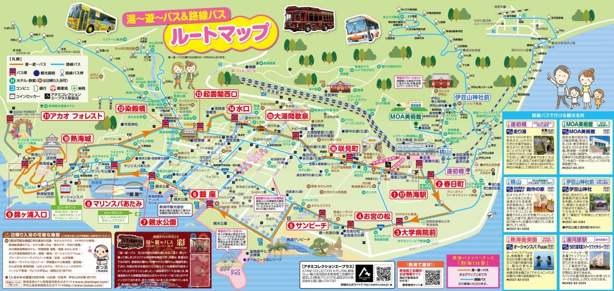

# TsukuCTF 2022

https://ctftime.org/event/1753

Team: Ir0nMaiden, Score: 4840, Rank: 53


OSINTばかり解きました。

- [[OSINT easy 100] Attack of Tsukushi(215 solves)](#osint-easy-100-attack-of-tsukushi215-solves)
- [[OSINT easy 108] Money(199 solves)](#osint-easy-108-money199-solves)
- [[OSINT easy 218] FlyMeToTheTsukushi(169 solves)](#osint-easy-218-flymetothetsukushi169-solves)
- [[OSINT easy 302] inuyama082(142 solves)](#osint-easy-302-inuyama082142-solves)
- [[OSINT easy 375] sky(113 solves)](#osint-easy-375-sky113-solves)
- [[OSINT easy 382] station(110 solves)](#osint-easy-382-station110-solves)
- [[OSINT easy 400] douro(101 solves)](#osint-easy-400-douro101-solves)
- [[OSINT easy 406] Where(98 solves)](#osint-easy-406-where98-solves)
- [[OSINT medium 433] Gorgeous Interior Bus(83 solves)](#osint-medium-433-gorgeous-interior-bus83-solves)
- [[OSINT easy 446] Bringer_of_happpiness(75 solves)](#osint-easy-446-bringer_of_happpiness75-solves)
- [[OSINT medium 454] Desk(69 solves)](#osint-medium-454-desk69-solves)
- [[OSINT medium 494] Flash(26 solves)](#osint-medium-494-flash26-solves)
- [後でやる](#後でやる)
- [感想](#感想)


## [OSINT easy 100] Attack of Tsukushi(215 solves)

つくしくんはある観光地を調査した際に訪れた駅で写真を撮影した。果たしてこの写真が撮られた駅はどこだろうか？ フラグは駅の郵便番号（ハイフンなし）を入力して下さい
e.g. 東京駅の場合は郵便番号が100-0005なのでフラグは TsukuCTF22{1000005} となります。


### SOLUTION

「リヴァイ　銅像」で検索した。

https://shingeki-hita.com/spot/016.html


```
TsukuCTF22{8770013}
```

## [OSINT easy 108] Money(199 solves)

どこ？ フラグは写真が撮影された場所の郵便番号(ハイフンを除く)を入れて下さい。例えば撮影された場所が東京都庁の場合、郵便番号は163-8001なのでTsukuCTF22{1638001}となります。


### SOLUTION

Google Lensを使うと金閣寺であることが判明した。

```
TsukuCTF22{6038361}
```

## [OSINT easy 218] FlyMeToTheTsukushi(169 solves)

つくし君は、はるばる飛行機で愛するパートナーのもとへやってきました。ここはどこの空港かわかりますか？
この問題はフラグを10回までしか提出できません。 ※フラグの形式はTsukuCTF22{空港名}です。空港の名前だけを入力してください。(hoge空港の場合、hogeのみがフラグになります)


### SOLUTION

「TAKENOYA」が画像に写っており、空港付近のお店を検索したところ以下がヒットした。

https://www.umakamonya.com/shoplist/shop60

```
TsukuCTF22{福岡}
```

## [OSINT easy 302] inuyama082(142 solves)

つくし君は愛知県犬山市にデートに来た時の思い出の写真を見返しています。 おいしそうな写真を見つけ、おやつが食べたくなりました。 写真のおやつの名前を教えてください。
※フラグの形式はTsukuCTF22{XXXXXXX ver.XXXXXX}です。


### SOLUTION

inuyamaから「犬山　カフェ」で検索し、最中が売られている店を探した。

https://www.yoakeya1916.com/menu-%E3%83%A1%E3%83%8B%E3%83%A5%E3%83%BC/caf%C3%A9-menu-%E3%82%AB%E3%83%95%E3%82%A7%E3%83%A1%E3%83%8B%E3%83%A5%E3%83%BC/ 

```
TsukuCTF22{和チーズケーキ ver.煎茶パウダー}
```

## [OSINT easy 375] sky(113 solves)

帰ってくるあなたが最高のプレゼント。つくし君は電車にガタゴト揺られています。次の停車駅で降りるようなのですが、どこかわかりますか？
※フラグの形式はTsukuCTF22{次の停車駅}です。公式サイトの表記を採用します(スペースは含めません)。


### SOLUTION

windという雑誌から、名鉄の特急だと予想。

https://www.mwt.co.jp/kaigai/tokai/wind/

skyから、ミュースカイという特急だと予想。

https://www.meitetsu.co.jp/qa/train/first_class_car/index.html

その後、wikipediaの停車駅一覧から順に入力。

https://ja.wikipedia.org/wiki/%E5%90%8D%E9%89%84%E7%89%B9%E6%80%A5#%E5%B8%B8%E6%BB%91%E7%B7%9A%E3%83%BB%E7%A9%BA%E6%B8%AF%E7%B7%9A%EF%BC%88%E3%83%9F%E3%83%A5%E3%83%BC%E3%82%B9%E3%82%AB%E3%82%A4%EF%BC%89 

```
TsukuCTF22{名鉄名古屋}
```

## [OSINT easy 382] station(110 solves)

つくし君はとある駅で友達を待っています。さて、つくし君はどこの駅にいるでしょうか？

TsukuCTF22{駅名(漢字、平仮名、英語可)}


### SOLUTION

画像から、東豊線と南北線が合流する駅を絞り、なおかつ「〜丁目」という駅名を調べた

https://ja.wikipedia.org/wiki/%E6%9C%AD%E5%B9%8C%E5%B8%82%E5%96%B6%E5%9C%B0%E4%B8%8B%E9%89%84%E6%9D%B1%E8%A5%BF%E7%B7%9A

```
TsukuCTF22{西11丁目}
```


## [OSINT easy 400] douro(101 solves)

旅行中のつくし君は迷子になってしまったようです。うつむいています。送られてきた写真から場所を特定できますか？
※フラグの形式はTsukuCTF22{緯度_経度}です。ただし、緯度経度は十進法で小数点以下五桁目を切り捨てたものとします。


### SOLUTION

「よいほモール」が見えたので、付近を探索

https://www.google.com/maps/@34.5763729,136.5312642,3a,75y,63.47h,64.41t/data=!3m6!1e1!3m4!1s0py8FCJ-PtjpfuVuK6VtTQ!2e0!7i16384!8i8192?hl=en

```
TsukuCTF22{34.5763_136.5312}
```


## [OSINT easy 406] Where(98 solves)

北海道に住んでいるつくしさんは東京旅行に行った際に高層ビルの窓から写真を撮りました。
でも撮影した場所を忘れてしまったようです。この写真が撮影された場所について建物名を教えてあげてください。
フラグはこの建物の開業日(YYYY/MM/DD)です。たとえば、東京スカイツリーの開業日は2012年5月22日なので、フラグはTsukuCTF22{2012/05/22}となります。


### SOLUTION

お茶漬けの看板から渋谷区であることが判明。

https://www.flickr.com/photos/kasa51/26931193341

OIOIも見えたので、Google Mapから方角を絞った。すると大体以下の辺りであることがわかったため、高い建物が眼前にないことをヒントに「アベマタワーズ」か「渋谷パルコ」の２択に絞り、順に入力。


https://www.google.com/maps/dir/Tokyo,+Shibuya+City,+Jinnan,+1+Chome%E2%88%9222%E2%88%926+%E6%B8%8B%E8%B0%B7%E3%83%9E%E3%83%AB%E3%82%A4/BicCamera+Shibuya+Hachikoguchi+Store,+2+Chome-5-9+Dogenzaka,+Shibuya+City,+Tokyo+150-0043/@35.6618009,139.6972511,632m/data=!3m1!1e3!4m14!4m13!1m5!1m1!1s0x60188ca80b62dab7:0xe676ff8355b79831!2m2!1d139.7010863!2d35.6608725!1m5!1m1!1s0x60188ca827ed4e11:0x9a204eb5d814dc2e!2m2!1d139.6994879!2d35.6593786!3e3 


結果、渋谷パルコであることが判明。

https://ja.wikipedia.org/wiki/%E6%B8%8B%E8%B0%B7%E3%83%91%E3%83%AB%E3%82%B3

```
TsukuCTF22{1973/06/14}
```

## [OSINT medium 433] Gorgeous Interior Bus(83 solves)

観光地に来たつくし君は、豪華なバスを見かけたので、それに乗って観光することにしました。 その時、つくし君のお母さんから「どこにいるの？」と連絡が着ましたが、おっちょこちょいなつくし君は、観光地の名前も、乗っているバスの路線も忘れてしまい、とっさに車内の写真を撮って「ここ」と返信しました。 つくしくんはどこにいるのでしょうか？ つくしくんが写真を撮ったところに最も近い交差点の名前を特定してください。

※フラグの形式はTsukuCTF22{交差点の名前}です。


### SOLUTION

画像の掲示板から「あたみ」が見えたため「あたみ　バス」と検索し「湯～遊～バス」であると判明。

https://www.tokaibus.jp/rosen/yu_yu_bus.html

バスの現在位置を把握するべく、掲示板とルートマップ(https://www.tokaibus.jp/rosen/yu_yu_bus.html) を見ると「マリンスパあたみ」←「親水公園」←「銀座」の順に向かっていると判明。




そこで、以下の区間をストリートビューで探索。

https://www.google.com/maps/dir/Atami+Sun+Beach,+Higashikaigancho,+Atami,+Shizuoka+413-0012/Atami+Water+Park,+10+Nagisacho,+Atami,+Shizuoka+413-0014/@35.096854,139.0752661,18z/data=!4m14!4m13!1m5!1m1!1s0x6019bf2da754df55:0x1e064360cec6807c!2m2!1d139.0767083!2d35.098029!1m5!1m1!1s0x6019be5d90318743:0xd1da8fc50597dc2f!2m2!1d139.0757477!2d35.0952988!3e3

画像の場所

https://www.google.com/maps/@35.0971667,139.0751122,3a,90y,200.07h,84.04t/data=!3m9!1e1!3m7!1syeTQVPmybC_N8siDJEg6VQ!2e0!7i16384!8i8192!9m2!1b1!2i25

```
TsukuCTF22{東海岸町}
```

## [OSINT easy 446] Bringer_of_happpiness(75 solves)

つくしくんは荷物を運び終えて休憩してるときに撮った写真。さて撮影場所はどこだろう？ ※フラグの形式はTsukuCTF22{緯度_経度}です。ただし、緯度経度は十進法で小数点以下五桁目を切り捨てたものとします。


### SOLUTION

「電車　車体　黄色」と検索し、島原鉄道であることが判明。
https://toyokeizai.net/articles/-/625261

島原鉄道の駅一覧から、画像の位置が島原港駅近くであることが判明。
https://www.shimatetsu.co.jp/area/detail/?id=1


画像の位置。

https://www.google.com/maps/@32.7691119,130.3706239,3a,75y,179.5h,81.52t/data=!3m7!1e1!3m5!1sLgALzRriChvPTXKSyQpVYg!2e0!6shttps:%2F%2Fstreetviewpixels-pa.googleapis.com%2Fv1%2Fthumbnail%3Fpanoid%3DLgALzRriChvPTXKSyQpVYg%26cb_client%3Dmaps_sv.tactile.gps%26w%3D203%26h%3D100%26yaw%3D330.11954%26pitch%3D0%26thumbfov%3D100!7i16384!8i8192?hl=en


```
TsukuCTF22{32.7691_130.3706}
```


## [OSINT medium 454] Desk(69 solves)

つくし君の大好きなお姉さんのデスクを見学させてもらったよ。 さて、このデスクはどこにあるのだろうか?フラグ形式は写真が撮影された場所の郵便番号(ハイフンを除く)を入れて下さい。例えば撮影された場所が東京都庁の場合、郵便番号は163-8001なので TsukuCTF22{1638001} となります。


### SOLUTION

デスクの上に、沖縄らしき地図を発見。右下のキャラクターの正体を特定するために「沖縄　ゆるキャラ」で調べると「なんじぃ」であることが分かった。これにより、画像の位置が沖縄県南城市まで絞ることができた。

https://yurucaharamascot.com/okinawa1

以下の施設一覧で、一番パソコンが置いてそうな施設を探索。

https://www.kankou-nanjo.okinawa/

すると「南城市地域物産館」が正解だった。

https://www.kankou-nanjo.okinawa/buy/details/217


```
TsukuCTF22{9011511}
```


## [OSINT medium 494] Flash(26 solves)

つくし君からマイコンボードを借りたら、このマイコンを使って実験を行ったホテルと部屋番号がわかってしまった！！ マイコンのフラッシュメモリから読みだしたデータを渡すので、ホテル名と部屋番号を特定してください。 ※フラグの形式はTsukuCTF22{XXホテル&XXXXXXXXXXXX_部屋番号}です。

### SOLUTION

`$strings Flash.bin` から「apa-316-2428」という文字が見えたため、アパホテルの一覧を見るとそれらしきホテルが見つかった。

https://map.apahotel.com/map/460

```
TsukuCTF22{アパホテル&リゾート〈両国駅タワー〉_2428}
```


## 後でやる

- GrandpaMemory
  - ~~Intel 4004?~~
- what_time_is_it
  - 特急うずしお
- uTSUKUSHIi
  - British Shorthair?
- Bus POWER
  - 京都ヤサカタクシー

## 感想

もっと早く解けるようになりたいなと思いました。運営ありがとうございました。
