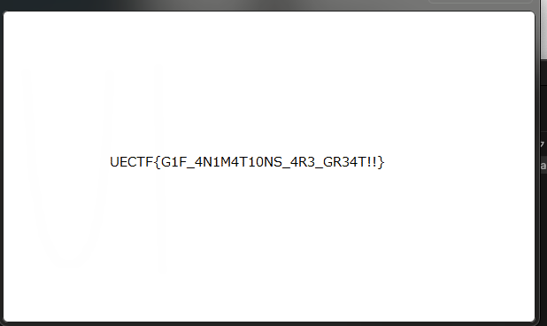
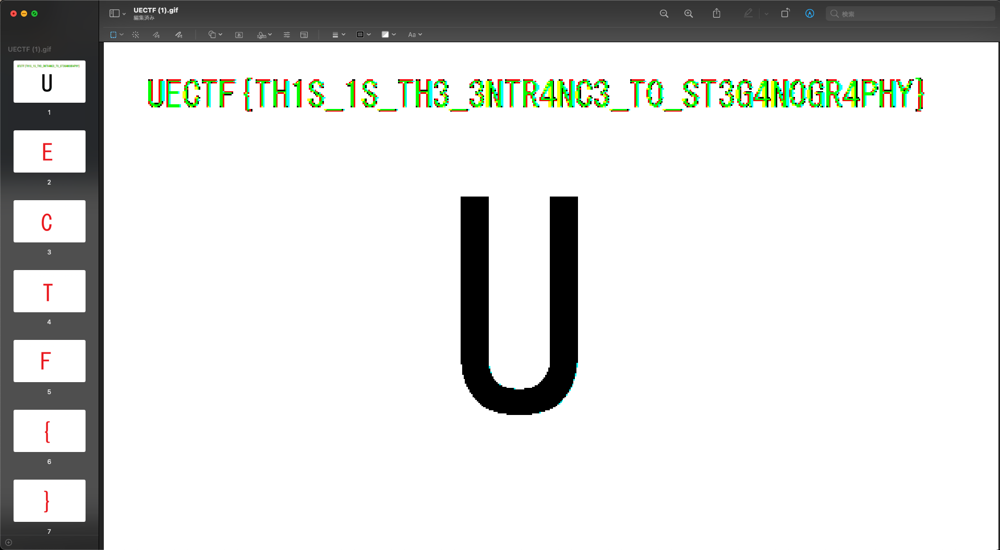

# UECTF2022

https://uectf.uec.tokyo/

place: 31st, points: 1210

解けなかった問題は最後に載せた。

- [UECTF2022](#uectf2022)
  - [\[rev easy\] A file (81solves)](#rev-easy-a-file-81solves)
  - [\[rev\] captain-hook (21solves)](#rev-captain-hook-21solves)
  - [\[crypto noob\] RSA (57solves)](#crypto-noob-rsa-57solves)
  - [\[pwn noob\]buffer\_overflow (48solves)](#pwn-noobbuffer_overflow-48solves)
  - [\[Forensics\] Deleted (53solves)](#forensics-deleted-53solves)
  - [\[web noob\] webapi (42sovles)](#web-noob-webapi-42sovles)
  - [\[misc noob\] caesar (68solves)](#misc-noob-caesar-68solves)
  - [\[misc\] redaction gone wrong 1 (71solves)](#misc-redaction-gone-wrong-1-71solves)
  - [\[misc\] redaction gone wrong 2 (54solves)](#misc-redaction-gone-wrong-2-54solves)
  - [\[misc steg/easy\] GIF1 (59solves)](#misc-stegeasy-gif1-59solves)
  - [\[misc steg\] GIF2 (30solves)](#misc-steg-gif2-30solves)
  - [\[rev\] discrete : unsolved](#rev-discrete--unsolved)
  - [\[rev\] revPython : unsolved](#rev-revpython--unsolved)
  - [\[Forensics\] Compare : unsolved](#forensics-compare--unsolved)
  - [\[Forensics\] Discord 1 : unsolved](#forensics-discord-1--unsolved)
  - [\[Forensics\] Discord 2 : unsolved](#forensics-discord-2--unsolved)
  - [\[misc\] PDF : unsolved](#misc-pdf--unsolved)
  - [\[misc\] WHEREAMI : unsolved](#misc-whereami--unsolved)
  - [\[misc\] OSINT : unsolved](#misc-osint--unsolved)

## [rev easy] A file (81solves)

> 誰かがファイルの拡張子を消してしまった。どのような中身のファイルなのか？
Someone erased a file extension. What contents is the file?

拡張子をつけた後、stringsコマンドで発見した。

```bash
$ file ./chall
chall: XZ compressed data
$ unxz ./chall
unxz: ./chall: Filename has an unknown suffix, skipping
$ mv ./chall ./chall.xz
strings chall | grep CTF
UECTF{Linux_c0mm4nDs_ar3_50_h3LPFU1!}
```

```
UECTF{Linux_c0mm4nDs_ar3_50_h3LPFU1!}
```

## [rev] captain-hook (21solves)

>haha, good luck solving this
運も実力のうち！

`rand`の値によって、フラグの出力フラグが決まっていた。また、ptrace検知が走っていたためgdbでフラグを書き換えることは難しそうだった。そこで、`main()`の始めからフラグを出力する関数まで全てNOP(0x90)で埋めた。

before
```c
000011a0  int32_t main(int32_t argc, char** argv, char** envp)
000011a6      sub_14a0()
000011b5      srand(x: time(nullptr))
000011ca      int32_t rax_4 = (rand() + 3) * rand()
000011d0      int32_t r12_3
000011d0      if (rax_4 == 0)
000011e6          r12_3 = (rand() + 1) * (rand() + 3)
000011ed          if (r12_3 == 0)
000011f6              puts(str: "success")
000011fb              sub_1330()
000011ed      if (rax_4 != 0 || (rax_4 == 0 && r12_3 != 0))
0000120d          r12_3 = -1
00001211          puts(str: "failure")
00001205      return r12_3
```

after
```c
000011a0  int32_t main(int32_t argc, char** argv, char** envp)
000011a0  {
000011a4      int64_t r12;
000011a4      int64_t var_8 = r12;
000011f6      puts("success");
000011fb      sub_1330();
00001205      return r12;
00001200  }
```


```
$ ./captainhook
success
UECTF{hmmmm_how_did_you_solve_this?}
```

## [crypto noob] RSA (57solves)

>RSA暗号でフラグを暗号化してみました！解読してみてください。I encrypted the flag with the RSA cipher! Please try to decode it.

配布されたソースコード
```python
from Crypto.Util.number import getPrime, inverse, bytes_to_long, long_to_bytes, GCD

def enc(p_text):
  N=p*q
  c_text=pow(p_text,e,N)
  #cipher_text=plain_text^e mod N
  print('cipher text:',c_text)
  print('p:',p)
  print('q:',q)
  print('e:',e)

e = 65537
p = getPrime(100)
q = getPrime(100)

#e:public key
#p,q: prime number

plain=b'UECTF{SECRET}'
plain=bytes_to_long(plain)
#bytes_to_long:bytes -> number
#long_to_bytes:number->bytes
enc(plain)
```
output.txt
```txt
cipher text: 40407051770242960331089168574985439308267920244282326945397
p: 1023912815644413192823405424909
q: 996359224633488278278270361951
e: 65537
```


RSAの仕組みより:

```python
from Crypto.Util.number import getPrime, inverse, bytes_to_long, long_to_bytes, GCD

def dec(e_text):
  m = pow(e_text, d, N)
  print('plain text:',long_to_bytes(m))

e = 65537
p = 1023912815644413192823405424909
q = 996359224633488278278270361951
d = inverse(e, (p-1)*(q-1))
N=p*q
# from output.txt
enc_text = 40407051770242960331089168574985439308267920244282326945397
dec(enc_text)
```

```bash
$ python3 rsa_source.py
plain text: b'UECTF{RSA-iS-VeRy-51Mp1e}'
```

## [pwn noob]buffer_overflow (48solves)

>バッファオーバーフローを知っていますか？
Do you know buffer overflow?
コンパイルオプションは-fno-stack-protectorをつけています。
gcc ./bof_source.c -fno-stack-protector
nc uectf.uec.tokyo 30002

配布されたソースコード
```c
#include<stdio.h>
#include<string.h>
int debug();
int main(){
  char debug_flag,name[15];
  debug_flag='0';
  printf("What is your name?\n>");
  scanf("%s",name);
  if(debug_flag=='1'){
    debug();
  }
  printf("Hello %s.\n",name);
  return 0;
}

int debug(){
  char flag[32]="CTF{THIS_IS_NOT_TRUE_FLAG}";
  printf("[DEBUG]:flag is %s\n",flag);
}
```

`if(debug_flag=='1'){`から`0x5610e35871a8 <main+63>:    cmp    BYTE PTR [rbp-0x1],0x31`より、`BYTE PTR [rbp-0x1]`が0x31になるようなpaddingを調査した。

```bash
[-------------------------------------code-------------------------------------]
   0x5610e358719b <main+50>:    mov    rdi,rax
   0x5610e358719e <main+53>:    mov    eax,0x0
   0x5610e35871a3 <main+58>:    call   0x5610e3587070 <__isoc99_scanf@plt>
=> 0x5610e35871a8 <main+63>:    cmp    BYTE PTR [rbp-0x1],0x31
   0x5610e35871ac <main+67>:    jne    0x5610e35871b8 <main+79>
   0x5610e35871ae <main+69>:    mov    eax,0x0
   0x5610e35871b3 <main+74>:    call   0x5610e35871da <debug>
   0x5610e35871b8 <main+79>:    lea    rax,[rbp-0x10]
[------------------------------------stack-------------------------------------]
0000| 0x7ffed3b0e6f0 ('A' <repeats 15 times>, "1")
0008| 0x7ffed3b0e6f8 ("AAAAAAA1")
0016| 0x7ffed3b0e700 --> 0x0
0024| 0x7ffed3b0e708 --> 0x7f5b16070d90 (<__libc_start_call_main+128>:  mov    edi,eax)
0032| 0x7ffed3b0e710 --> 0x0
0040| 0x7ffed3b0e718 --> 0x5610e3587169 (<main>:        endbr64)
0048| 0x7ffed3b0e720 --> 0x100000000
0056| 0x7ffed3b0e728 --> 0x7ffed3b0e818 --> 0x7ffed3b108ae ("/shared/bof_source")
[------------------------------------------------------------------------------]
Legend: code, data, rodata, value

Breakpoint 2, 0x00005610e35871a8 in main ()
gdb-peda$ x/20b $rbp-0x1
0x7ffed3b0e6ff: 0x31    0x00    0x00    0x00    0x00    0x00    0x00    0x00
0x7ffed3b0e707: 0x00    0x90    0x0d    0x07    0x16    0x5b    0x7f    0x00
0x7ffed3b0e70f: 0x00    0x00    0x00    0x00
gdb-peda$ c
Continuing.
[DEBUG]:flag is CTF{THIS_IS_NOT_TRUE_FLAG}
Hello AAAAAAAAAAAAAAA1.
[Inferior 1 (process 51) exited normally]
Warning: not running
```

本番環境

```bash
$ python3 -c 'print("A"*15 + "1", end="")' | nc uectf.uec.tokyo 30002
What is your name?
>[DEBUG]:flag is UECTF{ye4h_th1s_i5_B0f_flag}
Hello AAAAAAAAAAAAAAA1.
```

```
UECTF{ye4h_th1s_i5_B0f_flag}
```


## [Forensics] Deleted (53solves)

>USBメモリに保存してたフラグの情報消しちゃった。このイメージファイルからどうにか取り出せないものか…
I have deleted the flag information I saved on my USB stick. I wonder if there is any way to retrieve it from this image file...

`image.raw`ファイルが配布された。flsでinodeを調査した。

```bash
$ fls ./image.raw
r/r 4-128-1:	$AttrDef
r/r 8-128-2:	$BadClus
r/r 8-128-1:	$BadClus:$Bad
r/r 6-128-4:	$Bitmap
r/r 7-128-1:	$Boot
d/d 11-144-4:	$Extend
r/r 2-128-1:	$LogFile
r/r 0-128-6:	$MFT
r/r 1-128-1:	$MFTMirr
r/r 9-128-8:	$Secure:$SDS
r/r 9-144-11:	$Secure:$SDH
r/r 9-144-5:	$Secure:$SII
r/r 10-128-1:	$UpCase
r/r 10-128-4:	$UpCase:$Info
r/r 3-128-3:	$Volume
r/r 41-128-1:	mv_ARIMjapan_pc.jpg
r/r 41-128-3:	mv_ARIMjapan_pc.jpg:Zone.Identifier
r/r 44-128-1:	mv_choufusai2022_pc.png
r/r 44-128-3:	mv_choufusai2022_pc.png:Zone.Identifier
r/r 48-128-1:	mv_corona_pc.jpg
r/r 48-128-3:	mv_corona_pc.jpg:Zone.Identifier
r/r 46-128-1:	mv_oc2022-2-1_pc.tif
r/r 46-128-3:	mv_oc2022-2-1_pc.tif:Zone.Identifier
d/d 34-144-1:	System Volume Information
r/r 36-128-1:	uec.png
r/r 36-128-3:	uec.png:Zone.Identifier
r/r 45-128-1:	uec_ukraine_pc.jpg
r/r 45-128-3:	uec_ukraine_pc.jpg:Zone.Identifier
-/r * 37-128-1:	test1.txt
-/r * 39-128-1:	flag.png
-/r * 40-128-1:	uec.bmp
-/r * 42-128-1:	mv_ARIMjapan_pc.png
-/r * 42-128-3:	mv_ARIMjapan_pc.png:Zone.Identifier
-/r * 43-128-1:	mv_choufusai2022_pc.jpg
-/r * 43-128-3:	mv_choufusai2022_pc.jpg:Zone.Identifier
-/r * 47-128-1:	mv_oc2022-2-1_pc.jpg
-/r * 47-128-3:	mv_oc2022-2-1_pc.jpg:Zone.Identifier
-/r * 49-128-1:	uec.gif
-/r * 49-128-3:	uec.gif:Zone.Identifier
-/r * 50-128-1:	uec.jpg
-/r * 50-128-3:	uec.jpg:Zone.Identifier
-/r * 51-128-1:	uec.tif
-/r * 51-128-3:	uec.tif:Zone.Identifier
V/V 256:	$OrphanFiles
```

`-/r * 39-128-1:	flag.png` から、inodeの`39-128-1`番を指定すればよい。

```bash
icat image.raw 39-128-1 > flag.png
```
flag.pngを開くとフラグだった。

```
UECTF{TH1S_1M4G3_H4S_N0T_B33N_D3L3T3D}
```

## [web noob] webapi (42sovles)
> サーバーからフラグを取ってきて表示する web ページを作ったけど、上手く動かないのはなんでだろう？
I created a web page that fetches flags from the server and displays them, but why doesn't it work?
http://uectf.uec.tokyo:4447

そのままアクセスするとCORSエラーがでた。

```
Access to fetch at 'https://i5omltk3rg2vbwbymc73hnpey40eowfq.lambda-url.ap-northeast-1.on.aws/' from origin 'http://uectf.uec.tokyo:4447' has been blocked by CORS policy: No 'Access-Control-Allow-Origin' header is present on the requested resource. If an opaque response serves your needs, set the request's mode to 'no-cors' to fetch the resource with CORS disabled.
```

そこで、`fetch()`先のURLを直接curlした。

```bash
$ curl -X GET http://uectf.uec.tokyo:4447
<!DOCTYPE html>
<html lang="en">
<head>
  <meta charset="UTF-8">
  <meta http-equiv="X-UA-Compatible" content="IE=edge">
  <meta name="viewport" content="width=device-width, initial-scale=1.0">
  <title>Document</title>
</head>
<body>
  <h1>Hello world!</h1>
  <div class="flag">
    <span class="flag-label">Flag is here:</span>
    <span class="flag-data"></span>
  </div>
</body>

<script>
  const FLAG_URL = 'https://i5omltk3rg2vbwbymc73hnpey40eowfq.lambda-url.ap-northeast-1.on.aws/';
  fetch(FLAG_URL)
    .then(data => {
      document.getElementsByClassName('flag-data')[0].innerText = data;
    })
    .catch(err => {
      document.getElementsByClassName('flag-data')[0].innerText = 'server error';
    })
</script>
</html>%
$ curl -X GET https://i5omltk3rg2vbwbymc73hnpey40eowfq.lambda-url.ap-northeast-1.on.aws/
UECTF{cors_is_browser_feature}%
```

```
UECTF{cors_is_browser_feature}
```

## [misc noob] caesar (68solves)

> ガイウス・ユリウス・カエサル Gaius Iulius Caesar

配布されたソースコード
```python
from string import ascii_uppercase,ascii_lowercase,digits,punctuation

def encode(plain):
  cipher=''
  for i in plain:
    index=letter.index(i)
    cipher=cipher+letter[(index+14)%len(letter)]
  return cipher

ascii_all=''
for i in range(len(ascii_uppercase)):
  ascii_all=ascii_all+ascii_uppercase[i]+ascii_lowercase[i]
letter=ascii_all+digits+punctuation
plain_text='UECTF{SECRET}'
cipher_text=encode(plain_text)
print(cipher_text)
```

`encode()`でインデックスを14個ずらしていたので、マイナスによって戻した。

```python
from string import ascii_uppercase,ascii_lowercase,digits,punctuation

def encode(plain):
  cipher=''
  for i in plain:
    index=letter.index(i)
    cipher=cipher+letter[(index-14)%len(letter)] # here
  return cipher

ascii_all=''
for i in range(len(ascii_uppercase)):
  ascii_all=ascii_all+ascii_uppercase[i]+ascii_lowercase[i]
letter=ascii_all+digits+punctuation
plain_text='2LJ0MF0o&*E&zEhEi&1EKpmm&J3s1Ej)(zlYG' # caesar_output.txtより
cipher_text=encode(plain_text)
print(cipher_text)
```

```bash
$ python3 caesar_source.py
UECTF{Th15_1s_a_b1t_Diff1Cult_c43seR}
```


## [misc] redaction gone wrong 1 (71solves)

>NOBODY SHOULD JUST COPY AND PASTE MY FILES!
何人もコピペすべからず！

アプリ「プレビュー」で黒字をずらした。

```
UECTF{PDFs_AR3_D1ffiCulT_74d21e8}
```

## [misc] redaction gone wrong 2 (54solves)

>We have found this image floating on the internet. Can you tell us what is the redacted text?
インターネット上でこの画像を見つけた。隠されたテキストは何だろうか？


カラーバランスを調整した。


```
UECTF{N3ver_ever_use_A_p3n_rofl}
```

## [misc steg/easy] GIF1 (59solves)

>GIFアニメの中にフラグを隠したよ。え？隠れてないって？そんなぁ…
I tried to hide the flag with GIF animation. Huh? Not hidden...? Oh no...


フラグが映った瞬間をスクショした。



```
UECTF{G1F_4N1M4T10NS_4R3_GR34T!!}

```
## [misc steg] GIF2 (30solves)

>今度こそGIFアニメにフラグを隠したよ。人の目で見えるものだけが全てじゃないよ。
I tried to hide the flag in a GIF animation. It's not all about what people can see.


プレビューでgifを開いた後、カラーバランスを調整した



```
UECTF{TH1S_1S_TH3_3NTR4NC3_T0_ST3G4N0GR4PHY}
```

## [rev] discrete : unsolved
>Jumping around in memory
記憶の中でジャンプする

angrで解こうとしたものの解けなかった。どうやらavoidの指定が不要だったらしい。[mopiさんのソルバー](https://mopisec.hatenablog.com/entry/2022/11/21/091710)で解けた。avoidが刺さる時と刺さらない時の違いって何だろう。。。

```python
import angr
import sys
import claripy

EXEC_NAME = './discrete'
base_addr = 0x400000
FIND_ADDR = base_addr + 0x213d
# FIND_ADDR = base_addr + 0x2144

p = angr.Project(EXEC_NAME, load_options={"auto_load_libs": False})
state = p.factory.entry_state()
simgr = p.factory.simulation_manager(state)
simgr.explore(find=FIND_ADDR)

try:
    flag = simgr.found[0].posix.dumps(0)
    print(flag[:flag.find(b'\x00')].decode())
except IndexError:
    print("Something went wrong :(")
```

解けなかった時のsolver
```python
import angr
import sys
import claripy

input_file_path = './discrete'
base_addr = 0x400000
flag_length = 0x22
known_string = 'UECTF{'
FIND_ADDR = base_addr + 0x213d
AVOID_ADDR = base_addr + 0x2150
AVOID_ADDR2 = base_addr + 0x20f3

proj = angr.Project(input_file_path, load_options={'auto_load_libs': False})
known_chars = [claripy.BVV((known_string[i]))
               for i in range(len(known_string))]
flag_chars = [claripy.BVS(f"flag_{i}", 8)
              for i in range(flag_length - len(known_string))]
flag = claripy.Concat(*known_chars + flag_chars)
state = proj.factory.full_init_state(args=[input_file_path, flag])
sim_manager = proj.factory.simulation_manager(state)
sim_manager.explore(find={FIND_ADDR}, avoid={AVOID_ADDR, AVOID_ADDR2})

if(len(sim_manager.found) > 0):
    print(sim_manager.found[0].solver.eval(flag, cast_to=bytes))
```


```
UECTF{dynamic_static_strings_2022}
```

## [rev] revPython : unsolved

> What does this pyc file do?
これは?

python3.9のpycファイルをデコンパイルするために、pycdcを採用した。しかし、`# Unsupported opcode: WITH_EXCEPT_START`と出たため、[issue](https://github.com/zrax/pycdc/issues/195)に従い`pycdc/ASTree.cpp`の1185行目から以下のcaseを追加した。

```cpp
        case Pyc::WITH_EXCEPT_START:
        case Pyc::JUMP_IF_NOT_EXC_MATCH_A:
        case Pyc::RERAISE:
```
パッチ適用後、pycdcを実行すると以下が出力された。

```python
# Source Generated with Decompyle++
# File: a.cpython-39.pyc (Python 3.9)

from hashlib import sha256
prefix = 'UECTF{'
user_key = input('flag: ')

def H(localvalue = None):
    return sha256(localvalue.encode('utf-8')).hexdigest()


def xor_image(data = None, key = None):
    if type(key) != 'bytes':
        key = bytes(key, 'latin1')
    return None((lambda .0 = None: for i, d in .0:
d ^ key[i % len(prefix)])(enumerate(data)))


def run():
    if len(user_key) == 31 and user_key[:len(prefix)] == prefix and H(user_key) == 'ce6f4d9b828498b851adea9ba3bd5f6e21ec3f1a463616ed0d3ebd61954d3448':
        output = b''
        with open('flag.jpg', 'rb') as image_data:
            output = xor_image(image_data.read(), user_key)
            None(None, None, None)
        if not None or None:
            if None:
                with open('unpacked', 'wb') as f:
                    f.write(output)
                    None(None, None, None)
                if not None or None:
                    if None:
                        return None

if __name__ == '__main__':
```

ハッシュ値のdecryptから責めるのは厳しい。ここから手が止まった。

## [Forensics] Compare : unsolved

>新しくUECTFのロゴを作ったよ。え？元々あったロゴと同じじゃないかって？君はまだまだ甘いなぁ。
I made a new logo for UECTF. What, do you think it's the same as the original logo? You are still a bit naive.

`UECTF_org.bmp`と`UECTF_new.bmp`のどちらかを青空でいじると違う部分があり、データ配列が変わったことは分かった。同ツールで合成したり、XORしたりと色々したが分からなかった。

どうやら、xxdでダンプしたあとdiffをとれば分かるらしい（[参考](https://mopisec.hatenablog.com/entry/2022/11/21/091710)）。

```bash
xxd UECTF_new.bmp > UECTF_new.txt
xxd UECTF_org.bmp > UECTF_org.txt
diff UECTF_new.txt UECTF_org.txt > result
 grep -e ................ result.txt
< 00018dd0: ffff ffff 55ff ffff ffff ffff ffff ffff  ....U...........
> 00018dd0: ffff ffff ffff ffff ffff ffff ffff ffff  ................
< 000191a0: ff45 ffff ffff ffff ffff ffff ffff ffff  .E..............
> 000191a0: ffff ffff ffff ffff ffff ffff ffff ffff  ................
< 00019590: ffff ffff ffff ffff ffff ffff ffff 43ff  ..............C.
> 00019590: ffff ffff ffff ffff ffff ffff ffff ffff  ................
< 00019920: ffff ffff ffff ffff ffff ffff ffff ff54  ...............T
> 00019920: ffff ffff ffff ffff ffff ffff ffff ffff  ................
< 00019bb0: ffff ffff ffff ffff 46ff ffff ffff ffff  ........F.......
> 00019bb0: ffff ffff ffff ffff ffff ffff ffff ffff  ................
< 00019e30: ffff ffff ff7b ffff ffff ffff ffff ffff  .....{..........
> 00019e30: ffff ffff ffff ffff ffff ffff ffff ffff  ................
< 0001a080: ffff ffff ffff ffff ffff ffff ffff 63ff  ..............c.
> 0001a080: ffff ffff ffff ffff ffff ffff ffff ffff  ................
< 0001a2d0: ffff ffff ffff ffff ffff ff6f ffff ffff  ...........o....
> 0001a2d0: ffff ffff ffff ffff ffff ffff ffff ffff  ................
< 0001a4e0: ffff ffff ffff ffff ffff ffff 6dff ffff  ............m...
> 0001a4e0: ffff ffff ffff ffff ffff ffff ffff ffff  ................
< 0001a770: ffff ffff ff70 ffff ffff ffff ffff ffff  .....p..........
> 0001a770: ffff ffff ffff ffff ffff ffff ffff ffff  ................
< 0001aa20: ffff ffff ffff ffff ffff ffff ffff 61ff  ..............a.
> 0001aa20: ffff ffff ffff ffff ffff ffff ffff ffff  ................
< 0001ad10: ffff ffff ffff ff72 ffff ffff ffff ffff  .......r........
> 0001ad10: ffff ffff ffff ffff ffff ffff ffff ffff  ................
< 0001b000: ffff ffff ffff ffff ffff ffff 65ff ffff  ............e...
> 0001b000: ffff ffff ffff ffff ffff ffff ffff ffff  ................
< 0001b270: ff5f ffff ffff ffff ffff ffff ffff ffff  ._..............
> 0001b270: ffff ffff ffff ffff ffff ffff ffff ffff  ................
< 0001b4e0: ffff ffff ffff ffff ffff ffff ffff 74ff  ..............t.
> 0001b4e0: ffff ffff ffff ffff ffff ffff ffff ffff  ................
< 0001b770: ffff ffff ffff ff77 ffff ffff ffff ffff  .......w........
> 0001b770: ffff ffff ffff ffff ffff ffff ffff ffff  ................
< 0001b9f0: ffff ffff 6fff ffff ffff ffff ffff ffff  ....o...........
> 0001b9f0: ffff ffff ffff ffff ffff ffff ffff ffff  ................
< 0001bc50: ffff ffff ffff ffff ff5f ffff ffff ffff  ........._......
> 0001bc50: ffff ffff ffff ffff ffff ffff ffff ffff  ................
< 0001bec0: ffff ffff ffff ffff ffff 66ff ffff ffff  ..........f.....
> 0001bec0: ffff ffff ffff ffff ffff ffff ffff ffff  ................
< 0001c150: ffff ffff ffff ffff ffff ffff ffff ff69  ...............i
> 0001c150: ffff ffff ffff ffff ffff ffff ffff ffff  ................
< 0001c380: ffff ffff ffff ffff 6cff ffff ffff ffff  ........l.......
> 0001c380: ffff ffff ffff ffff ffff ffff ffff ffff  ................
< 0001c660: ffff ffff ff65 ffff ffff ffff ffff ffff  .....e..........
> 0001c660: ffff ffff ffff ffff ffff ffff ffff ffff  ................
< 0001c8c0: ffff ffff ffff ffff ffff 73ff ffff ffff  ..........s.....
> 0001c8c0: ffff ffff ffff ffff ffff ffff ffff ffff  ................
< 0001cae0: ffff ffff ffff ff5f ffff ffff ffff ffff  ......._........
> 0001cae0: ffff ffff ffff ffff ffff ffff ffff ffff  ................
< 0001ce00: ffff ffff ffff ffff ffff ffff 62ff ffff  ............b...
> 0001ce00: ffff ffff ffff ffff ffff ffff ffff ffff  ................
< 0001d050: ffff ffff ffff ffff ff79 ffff ffff ffff  .........y......
> 0001d050: ffff ffff ffff ffff ffff ffff ffff ffff  ................
< 0001d2e0: ffff 74ff ffff ffff ffff ffff ffff ffff  ..t.............
> 0001d2e0: ffff ffff ffff ffff ffff ffff ffff ffff  ................
< 0001d4e0: ffff ffff ffff ff65 ffff ffff ffff ffff  .......e........
> 0001d4e0: ffff ffff ffff ffff ffff ffff ffff ffff  ................
< 0001d710: ffff ffff ffff ffff ffff ffff 5fff ffff  ............_...
> 0001d710: ffff ffff ffff ffff ffff ffff ffff ffff  ................
< 0001d950: ff62 ffff ffff ffff ffff ffff ffff ffff  .b..............
> 0001d950: ffff ffff ffff ffff ffff ffff ffff ffff  ................
< 0001dbd0: ffff ffff ffff ffff ffff 79ff ffff ffff  ..........y.....
> 0001dbd0: ffff ffff ffff ffff ffff ffff ffff ffff  ................
< 0001de00: ffff ffff ffff ffff ffff ffff ffff ff5f  ..............._
> 0001de00: ffff ffff ffff ffff ffff ffff ffff ffff  ................
< 0001e090: ffff ffff ffff ffff 62ff ffff ffff ffff  ........b.......
> 0001e090: ffff ffff ffff ffff ffff ffff ffff ffff  ................
< 0001e2b0: ffff ffff ff79 ffff ffff ffff ffff ffff  .....y..........
> 0001e2b0: ffff ffff ffff ffff ffff ffff ffff ffff  ................
< 0001e4c0: ffff ffff ffff 74ff ffff ffff ffff ffff  ......t.........
> 0001e4c0: ffff ffff ffff ffff ffff ffff ffff ffff  ................
< 0001e6f0: ffff ffff ffff ffff ffff ff65 ffff ffff  ...........e....
> 0001e6f0: ffff ffff ffff ffff ffff ffff ffff ffff  ................
< 0001e880: ffff ffff ffff ffff 7dff ffff ffff ffff  ........}.......
> 0001e880: ffff ffff ffff ffff ffff ffff ffff ffff  ................
```

```
UECTF{compare_two_files_byte_by_byte}
```

## [Forensics] Discord 1 : unsolved

>数日前、CTFの作問をやっている友達が送ってきたフラグの書かれた画像がいつの間にか消されていた。あれがあればこの問題にも正解できるはず… 調べたらDiscordのデータはこのフォルダに色々保存されているらしい。何とかして消された画像を見つけられないだろうか…
A few days ago, a friend of mine who is doing a CTF composition question sent me an image with the flag written on it, which was deleted. If I had that one, I should be able to answer this question correctly... I checked and it seems that Discord data is stored in this folder. I wonder if there is any way to find the deleted image...

`./discord/Cache`が怪しく、`strings ./discord/Cache/**/* | grep CTF`で探したが、見つからなかった。flagのほうで探すとあったらしい。

```bash
strings ./discord/Cache/**/* | grep flag
whttps://media.discordapp.net/attachments/1039034703644205099/1039047405426982942/flag1.png?width=400&height=19
https://media.discordapp.net/attachments/1039034703644205099/1039047405426982942/flag1.png
////
```

## [Forensics] Discord 2 : unsolved

>前に思いついたフラグ送信しようとして止めたんだけど、やっぱりあれが良かったなぁ… でもちゃんと思い出せないなぁ。このフォルダにはキャッシュとかも残ってるし、どこかに編集履歴みたいなの残ってないかなぁ…
I tried to send to a friend the flag I thought of before and stopped, but I still liked that one... But I can't remember it properly. I'm sure there's a cache or something in this folder, and I'm wondering if there's some kind of edit history somewhere...

stringsとgrepだけで解けた。

```bash
# discord2/Local Storage/leveldb
strings ./discord2/**/* | grep CTF
{"_state":{"1039033893849944084":{"1039070178207617074":{"0":{"timestamp":1667806462142,"draft":"UECTF{Y0U_C4N_S33_Y0UR_DRAFT}"}}}},"_version":2}
```

## [misc] PDF : unsolved

`peepdf`でSuspicious elementsを探ったが手応えなし。

```bash
PPDF> open ../chall.pdf

File opened succesfully!!

Warning: PyV8 is not installed!!


File: chall.pdf
MD5: 66baaccd79e808ce852c95bcec84c2a2
SHA1: 4005d2ff5d25b8bb24e9662e83b1f5d78b84ace9
Size: 71718 bytes
Version: 1.5
Binary: True
Linearized: True
Encrypted: False
Updates: 1
Objects: 459
Streams: 126
URIs: 0
Comments: 0
Errors: 0

Version 0:
        Catalog: 449
        Info: 447
        Objects (1): [448]
        Streams (0): []

Version 1:
        Catalog: No
        Info: No
        Objects (458): [1, 2, 3, 4, 5, 6, 7, 8, 9, 10, 11, 12, 13, 14, 15, 16, 17, 18, 19, 20, 21, 22, 23, 24, 25, 26, 27, 28, 29, 30, 31, 32, 33, 34, 35, 36, 37, 38, 39, 40, 41, 42, 43, 44, 45, 46, 47, 48, 49, 50, 51, 52, 53, 54, 55, 56, 57, 58, 59, 60, 61, 62, 63, 64, 65, 66, 67, 68, 69, 70, 71, 72, 73, 74, 75, 76, 77, 78, 79, 80, 81, 82, 83, 84, 85, 86, 87, 88, 89, 90, 91, 92, 93, 94, 95, 96, 97, 98, 99, 100, 101, 102, 103, 104, 105, 106, 107, 108, 109, 110, 111, 112, 113, 114, 115, 116, 117, 118, 119, 120, 121, 122, 123, 124, 125, 126, 127, 128, 129, 130, 131, 132, 133, 134, 135, 136, 137, 138, 139, 140, 141, 142, 143, 144, 145, 146, 147, 148, 149, 150, 151, 152, 153, 154, 155, 156, 157, 158, 159, 160, 161, 162, 163, 164, 165, 166, 167, 168, 169, 170, 171, 172, 173, 174, 175, 176, 177, 178, 179, 180, 181, 182, 183, 184, 185, 186, 187, 188, 189, 190, 191, 192, 193, 194, 195, 196, 197, 198, 199, 200, 201, 202, 203, 204, 205, 206, 207, 208, 209, 210, 211, 212, 213, 214, 215, 216, 217, 218, 219, 220, 221, 222, 223, 224, 225, 226, 227, 228, 229, 230, 231, 232, 233, 234, 235, 236, 237, 238, 239, 240, 241, 242, 243, 244, 245, 246, 247, 248, 249, 250, 251, 252, 253, 254, 255, 256, 257, 258, 259, 260, 261, 262, 263, 264, 265, 266, 267, 268, 269, 270, 271, 272, 273, 274, 275, 276, 277, 278, 279, 280, 281, 282, 283, 284, 285, 286, 287, 288, 289, 290, 291, 292, 293, 294, 295, 296, 297, 298, 299, 300, 301, 302, 303, 304, 305, 306, 307, 308, 309, 310, 311, 312, 313, 314, 315, 316, 317, 318, 319, 320, 321, 322, 323, 324, 325, 326, 327, 328, 329, 330, 331, 332, 333, 334, 335, 336, 337, 338, 339, 340, 341, 342, 343, 344, 345, 346, 347, 348, 349, 350, 351, 352, 353, 354, 355, 356, 357, 358, 359, 360, 361, 362, 363, 364, 365, 366, 367, 368, 369, 370, 371, 372, 373, 374, 375, 376, 377, 378, 379, 380, 381, 382, 383, 384, 385, 386, 387, 388, 389, 390, 391, 392, 393, 394, 395, 396, 397, 398, 399, 400, 401, 402, 403, 404, 405, 406, 407, 408, 409, 410, 411, 412, 413, 414, 415, 416, 417, 418, 419, 420, 421, 422, 423, 424, 425, 426, 427, 428, 429, 430, 431, 432, 433, 434, 435, 436, 437, 438, 439, 440, 441, 442, 443, 444, 445, 446, 447, 449, 450, 451, 452, 453, 454, 455, 456, 457, 458, 459]
        Streams (126): [451, 454, 457, 459, 3, 6, 9, 12, 15, 18, 21, 24, 27, 30, 33, 36, 39, 42, 45, 48, 51, 54, 57, 60, 63, 66, 69, 72, 75, 78, 81, 84, 87, 90, 93, 96, 99, 102, 105, 108, 111, 114, 117, 120, 123, 126, 129, 132, 135, 138, 141, 144, 147, 150, 153, 156, 159, 162, 165, 168, 171, 174, 177, 180, 183, 186, 189, 192, 195, 198, 201, 204, 207, 210, 213, 216, 219, 222, 225, 228, 231, 234, 237, 240, 243, 246, 249, 252, 255, 258, 261, 264, 267, 270, 273, 276, 279, 282, 285, 288, 291, 294, 297, 300, 303, 306, 309, 312, 315, 318, 321, 324, 327, 330, 333, 336, 339, 342, 345, 348, 351, 354, 357, 360, 387, 389]
                Encoded (125): [451, 454, 457, 459, 3, 6, 9, 12, 15, 18, 21, 24, 27, 30, 33, 36, 39, 42, 45, 48, 51, 54, 57, 60, 63, 66, 69, 72, 75, 78, 81, 84, 87, 90, 93, 96, 99, 102, 105, 108, 111, 114, 117, 120, 123, 126, 129, 132, 135, 138, 141, 144, 147, 150, 153, 156, 159, 162, 165, 168, 171, 174, 177, 180, 183, 186, 189, 192, 195, 198, 201, 204, 207, 210, 213, 216, 219, 222, 225, 228, 231, 234, 237, 240, 243, 246, 249, 252, 255, 258, 261, 264, 267, 270, 273, 276, 279, 282, 285, 288, 291, 294, 297, 300, 303, 306, 309, 312, 315, 318, 321, 324, 327, 330, 333, 336, 339, 342, 345, 348, 351, 354, 357, 360, 387]
        Suspicious elements:
                /OpenAction (1): [449]
                /Names (9): [449, 435, 436, 437, 438, 439, 440, 441, 442]
```

## [misc] WHEREAMI : unsolved

>あなたの元に友人から「私はどこにいるでしょう？」という件名の謎の文字列が書かれたメールが送られてきました。 さて、これは何を示しているのでしょうか？
You receive an email from your friend with a mysterious string of text with the subject line "Where am I?" Now, what does this indicate?

`mail.txt`を開くと、[plus code](https://support.google.com/maps/answer/7047426?hl=ja&co=GENIE.Platform%3DDesktop&oco=0)が書かれていた。
そのうちの1つをGoogle Mapで検索すると[北太平洋を指していた](https://www.google.com/maps/place/7RJP2C22%2B22/@22,154.3978114,17z/data=!4m13!1m7!3m6!1s0x0:0x36d8c289906bb74!2s7RJP2C22%2B22!3b1!8m2!3d22!4d154.4000001!3m4!1s0x0:0x36d8c289906bb74!8m2!3d22!4d154.4000001)。

## [misc] OSINT : unsolved

>There is this link to a Twitter account. However, Twitter says that "This account doesn’t exist." Could you somehow use your magic to find this person? I'm pretty sure he's still using Twitter. Thanks!!
あるTwitterアカウントへのリンクがありました。アクセスすると"このアカウントは存在しません"と表示されて困っているんだ...😖 他の情報源によるとTwitterをまだやっているはずなんだけどなぁ🤔
https://twitter.com/__yata_nano__

[webpack machine](https://web.archive.org/web/20221026140525/https://twitter.com/__yata_nano__)で同アカウントが引っかかった。

以下、[s98tさんのwriteup](https://nanimokangaeteinai.hateblo.jp/entry/2022/11/20/200406#MISC-436-OSINT-13-solves)を再現しました。

ソースの`"identifier": "1585261641125416961"`から、[https://twitter.com/intent/user?user_id=1585261641125416961](https://twitter.com/intent/user?user_id=1585261641125416961)にアクセスした。[@ftceu](https://twitter.com/ftceu)のアカウントに遷移し、トップツイートのパスワードを https://pastebin.com/EDATYTtg に入力するとフラグが出た。
```js
// https://web.archive.org/web/20221026140525/https://twitter.com/__yata_nano__
{
  "@context": "https://web.archive.org/web/20221026140525/http://schema.org",
  "@type": "ProfilePage",
  "dateCreated": "2022-10-26T13:26:48.000Z",
  "author": {
    "@type": "Person",
    "additionalName": "__yata_nano__",
    "description": "",
    "givenName": "name",
    "homeLocation": {
      "@type": "Place",
      "name": ""
    },
    "identifier": "1585261641125416961",
    "image": {
      "@type": "ImageObject",
      "contentUrl": "https://web.archive.org/web/20221026140525/https://pbs.twimg.com/profile_images/1585263988350210051/6X4jmbrS_400x400.jpg",
      "thumbnailUrl": "https://web.archive.org/web/20221026140525/https://pbs.twimg.com/profile_images/1585263988350210051/6X4jmbrS_normal.jpg"
    },
    ///省略
}
```

```
UECTF{ur_a_tw1tter_mast3r__arent_y0u}
```