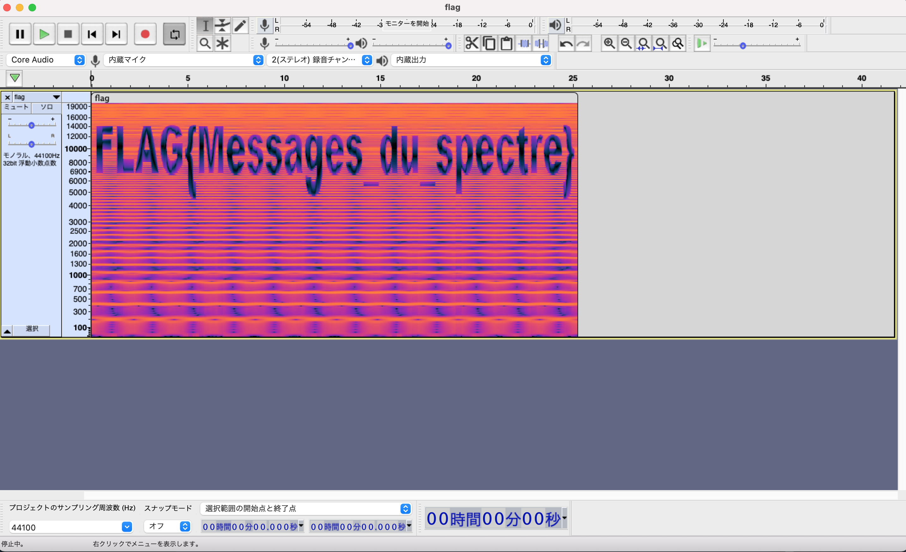

# forensics

## propaganda

### 問題文

超人気ゲームをみんなでプレイしよう！

### 解説

動画ファイルを開くと，プレイ中にFLAGが表示される．

### FLAG

```
FLAG{Stand_tall_We_are_Valorant_We_are_fighters!}
```

## sonic

### 問題文

妖怪からのメッセージです．

音量注意！

## 解説

wavファイルをAudacityで開きます．

スペクトログラムを表示するとフラグが出てきました．



### FLAG

```
FLAG{Messages_du_spectre}
```

## poly

### 問題文

お前...pngか...？

FLAGの中身はすべて小文字です．

### 解説

png形式でmp3と書かれたファイルだったので，pngのマジックナンバをmp3のものへ書き換えれば良いと判断しました．

そこで，バイナリモードで編集し，先頭を`89 50 4e 47`から`ff f3 40 c0`に書き換え，拡張子をmp3へ変更しました．

mp3ファイルを開くとFLAGを読み上げる機械音が聞こえました．

### FLAG

```
FLAG{thisismpg3}
```

### 参考

- https://qiita.com/forestsource/items/15933888466ba9c3f048
